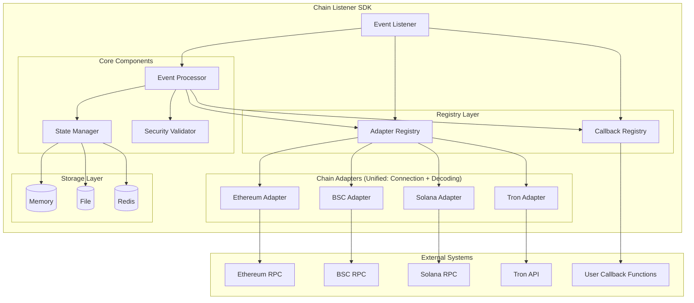
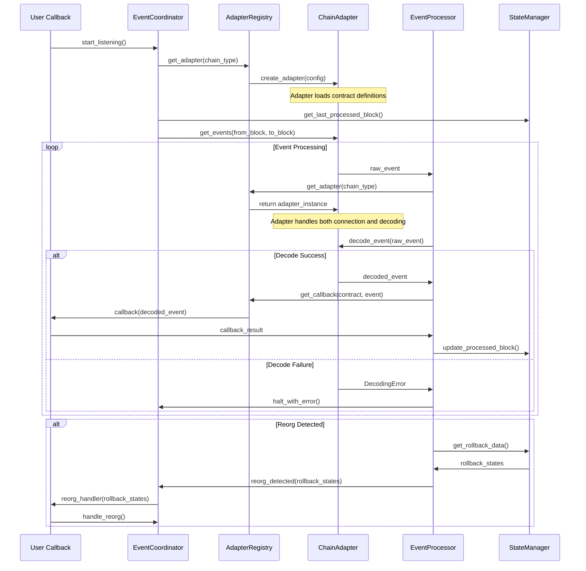

# Multi-Chain Event Listener SDK - Technical Solution

## 📋 Table of Contents
1. [System Architecture](#system-architecture)
2. [Unified Chain Adapter Design](#unified-chain-adapter-design)
3. [Event Processing Pipeline](#event-processing-pipeline)
4. [State Management & Persistence](#state-management--persistence)
5. [Configuration Management](#configuration-management)
6. [Error Handling & Reorg Protection](#error-handling-&-reorg-protection)
7. [API Design](#api-design)
8. [Data Models](#data-models)
9. [Implementation Plan](#implementation-plan)

---

## System Architecture

### High-Level Architecture



### Core Component Design

#### 1. Registry Pattern (注册表模式)
- **职责**: 管理适配器、回调的注册和查找
- **特点**: 解耦组件间的直接依赖，支持动态扩展
- **优化**: 无工厂模式，直接实例化，简化复杂度

#### 2. Interface Abstraction (接口抽象)
- **职责**: 定义统一的适配器接口规范
- **特点**: 所有解码器实现BaseAdapter接口
- **优势**: 类型安全、易于测试、支持多态

#### 3. Chain Type Mapping (链类型映射)
- **职责**: 支持兼容链类型的解码器复用
- **特点**: BSC/Polygon映射到EVM解码器
- **优势**: 减少重复实现，提高维护效率

#### 4. Security-First Design (安全优先)
- **职责**: 输入验证、URL安全检查、资源限制
- **特点**: 所有外部输入都经过安全验证

#### 5. Decoupled Architecture (解耦架构)
- **职责**: 组件间通过接口通信，降低耦合度
- **特点**: 依赖注入、接口抽象、松耦合设计

---

## Unified Chain Adapter Design

### Registry-Based Adapter Management

```python
from abc import ABC, abstractmethod
from typing import Dict, List, Optional, Any, AsyncGenerator
from dataclasses import dataclass
from enum import Enum
from urllib.parse import urlparse

class ChainType(Enum):
    ETHEREUM = "ethereum"
    BSC = "bsc"
    POLYGON = "polygon"
    SOLANA = "solana"
    TRON = "tron"

@dataclass
class ChainConfig:
    chain_type: ChainType
    rpc_endpoints: List[str]
    confirmation_blocks: int
    retry_attempts: int = 3
    timeout: float = 30.0
    polling_interval: float = 1.0

    def __post_init__(self):
        """验证RPC URL安全性"""
        for url in self.rpc_endpoints:
            SecurityValidator.validate_rpc_url(url)

@dataclass
class RawEvent:
    chain_type: ChainType
    block_number: int
    block_hash: str
    transaction_hash: str
    log_index: int
    contract_address: str
    raw_data: Dict[str, Any]
    timestamp: int

class SecurityValidator:
    """安全验证器"""

    @staticmethod
    def validate_rpc_url(url: str) -> bool:
        """验证RPC URL安全性"""
        try:
            parsed = urlparse(url)
            if parsed.scheme not in ['https', 'wss']:
                raise SecurityError(f"Insecure RPC URL scheme: {parsed.scheme}")

            if not parsed.netloc:
                raise SecurityError("Invalid RPC URL: no hostname")

            # 防止SSRF攻击的额外检查
            hostname = parsed.hostname
            if hostname in ['localhost', '127.0.0.1', '0.0.0.0']:
                raise SecurityError("Localhost RPC URLs not allowed in production")

            return True
        except Exception as e:
            raise SecurityError(f"Invalid RPC URL: {e}") from e

class AdapterRegistry:
    """适配器注册表"""

    def __init__(self):
        self._adapters: Dict[ChainType, Callable[[ChainConfig], BaseAdapter]] = {}

    def register(self, chain_type: ChainType, adapter_factory: Callable[[ChainConfig], BaseAdapter]):
        """注册适配器工厂函数"""
        self._adapters[chain_type] = adapter_factory

    def create_adapter(self, config: ChainConfig) -> BaseAdapter:
        """创建适配器实例"""
        adapter_factory = self._adapters.get(config.chain_type)
        if not adapter_factory:
            raise UnsupportedChainError(f"No adapter registered for {config.chain_type}")
        return adapter_factory(config)

# 默认适配器注册表工厂
def create_default_adapter_registry() -> AdapterRegistry:
    """创建默认适配器注册表"""
    registry = AdapterRegistry()

    # 注册适配器工厂函数
    registry.register_adapter_factory(ChainType.ETHEREUM, lambda config: EthereumAdapter(config))
    registry.register_adapter_factory(ChainType.BSC, lambda config: EthereumAdapter(config))
    registry.register_adapter_factory(ChainType.POLYGON, lambda config: EthereumAdapter(config))
    registry.register_adapter_factory(ChainType.SOLANA, lambda config: SolanaAdapter(config))
    registry.register_adapter_factory(ChainType.TRON, lambda config: TronAdapter(config))

    return registry

class ChainAdapter(ABC):
    """统一的区块链适配器 - 内连接获取与事件解码功能"""

    def __init__(self, config: ChainConfig):
        self.config = config
        self.connection_pool = None

    # 连接管理方法
    @abstractmethod
    async def connect(self) -> None:
        """建立连接并初始化连接池"""
        pass

    @abstractmethod
    async def disconnect(self) -> None:
        """关闭连接"""
        pass

    # 数据获取方法
    @abstractmethod
    async def get_latest_block_number(self) -> int:
        """获取最新区块高度"""
        pass

    @abstractmethod
    async def get_events(
        self,
        from_block: int,
        to_block: int,
        contract_addresses: List[str],
        event_signatures: Optional[List[str]] = None
    ) -> AsyncGenerator[RawEvent, None]:
        """获取指定区块范围内的事件"""
        pass

    @abstractmethod
    async def validate_block_hash(self, block_number: int, expected_hash: str) -> bool:
        """验证区块哈希，用于检测重组"""
        pass

    # 事件解码方法
    @abstractmethod
    async def decode_event(self, raw_event: RawEvent) -> DecodedEvent:
        """解码原始事件为结构化事件"""
        pass

    # 配置加载方法
    @abstractmethod
    def load_contract_definitions(self, contracts: Dict[str, ContractConfig]) -> None:
        """从配置加载合约ABI/IDL定义"""
        pass
```


### Connection Pool Strategy

每个适配器维护独立的连接池：
- **EVM Adapters**: 使用 `aiohttp.ClientSession` 连接池
- **Solana**: 使用专用 RPC 客户端连接池
- **Tron**: 使用 HTTP 客户端连接池

---

### Detail Chain Adapter Implementation (Adapter + Decoder Combined)

```python
import json
from typing import Dict, List, Optional
import aiohttp
import web3
from web3 import Web3

class EthereumAdapter(ChainAdapter):
    """Ethereum/EVM兼容链适配器 - 内连接获取与事件解码功能"""

    def __init__(self, config: ChainConfig, max_abi_size: int = 1024 * 1024):
        super().__init__(config)
        self.max_abi_size = max_abi_size
        self._abi_cache: Dict[str, Dict] = {}
        self.w3 = None
        self.session = None

    async def connect(self) -> None:
        """建立连接并初始化连接池"""
        # 创建Web3连接
        self.w3 = Web3(Web3.HTTPProvider(self.config.rpc_urls[0]))

        # 创建HTTP连接池
        connector = aiohttp.TCPConnector(
            limit=100,
            limit_per_host=20,
            ttl_dns_cache=300,
            use_dns_cache=True,
        )
        self.session = aiohttp.ClientSession(connector=connector)

        # 验证连接
        if not self.w3.is_connected():
            raise ConnectionError(f"Failed to connect to {self.config.chain_type}")

    async def disconnect(self) -> None:
        """关闭连接"""
        if self.session:
            await self.session.close()
        self.w3 = None

    async def get_latest_block_number(self) -> int:
        """获取最新区块高度"""
        return self.w3.eth.block_number

    async def get_events(
        self,
        from_block: int,
        to_block: int,
        contract_addresses: List[str],
        event_signatures: Optional[List[str]] = None
    ) -> AsyncGenerator[RawEvent, None]:
        """获取指定区块范围内的事件"""
        # 构建事件过滤器
        filter_params = {
            'fromBlock': from_block,
            'toBlock': to_block,
            'address': contract_addresses
        }

        if event_signatures:
            filter_params['topics'] = [event_signatures]

        # 获取事件日志
        logs = self.w3.eth.get_logs(filter_params)

        for log in logs:
            yield RawEvent(
                chain_type=self.config.chain_type,
                contract_address=log['address'],
                block_number=log['blockNumber'],
                transaction_hash=log['transactionHash'].hex(),
                log_index=log['logIndex'],
                data=log['data'],
                topics=[topic.hex() for topic in log['topics']],
                raw_data=log,
                timestamp=await self._get_block_timestamp(log['blockNumber'])
            )

    async def validate_block_hash(self, block_number: int, expected_hash: str) -> bool:
        """验证区块哈希，用于检测重组"""
        try:
            block = self.w3.eth.get_block(block_number)
            return block['hash'].hex().lower() == expected_hash.lower()
        except Exception:
            return False

    def load_contract_definitions(self, contracts: Dict[str, ContractConfig]) -> None:
        """从配置加载合约ABI定义"""
        for contract_name, contract_config in contracts.items():
            if contract_config.abi:
                abi = json.loads(contract_config.abi) if isinstance(contract_config.abi, str) else contract_config.abi

                # 验证ABI大小
                abi_str = json.dumps(abi)
                if len(abi_str.encode()) > self.max_abi_size:
                    raise DecodingError(f"ABI for {contract_name} too large: {len(abi_str)} bytes > {self.max_abi_size}")

                self._abi_cache[contract_config.address.lower()] = abi

    async def decode_event(self, raw_event: RawEvent) -> DecodedEvent:
        """解码EVM事件"""
        try:
            abi = self._abi_cache.get(raw_event.contract_address.lower())
            if not abi:
                raise DecodingError(f"No ABI configured for contract: {raw_event.contract_address}")

            event_signature = raw_event.raw_data.get('topics', [''])[0]
            if not event_signature:
                raise DecodingError("Missing event signature in topics")

            # 使用 web3.py 进行解码
            contract = self.w3.eth.contract(address=raw_event.contract_address, abi=abi)

            # 查找对应的事件
            event_obj = None
            for event in contract.events:
                if event.abi.get('signature') == event_signature:
                    event_obj = event
                    break

            if not event_obj:
                raise DecodingError(f"Event signature not found in ABI: {event_signature}")

            # 解码事件
            event = event_obj().process_log(raw_event.raw_data)

            return DecodedEvent(
                chain_type=raw_event.chain_type,
                contract_address=raw_event.contract_address,
                event_name=event.event,
                parameters=dict(event.args) if event.args else {},
                block_number=raw_event.block_number,
                transaction_hash=raw_event.transaction_hash,
                log_index=raw_event.log_index,
                timestamp=raw_event.timestamp
            )

        except Exception as e:
            raise DecodingError(f"Failed to decode EVM event: {e}") from e

    async def _get_block_timestamp(self, block_number: int) -> int:
        """获取区块时间戳"""
        try:
            block = self.w3.eth.get_block(block_number)
            return block['timestamp']
        except Exception:
            return 0

class SolanaAdapter(ChainAdapter):
    """Solana链适配器 - 内连接获取与事件解码功能"""

    def __init__(self, config: ChainConfig, max_idl_size: int = 2 * 1024 * 1024):
        super().__init__(config)
        self.max_idl_size = max_idl_size
        self._idl_cache: Dict[str, Dict] = {}
        self.client = None

    async def connect(self) -> None:
        """建立连接"""
        from solana.rpc.async_api import AsyncClient
        self.client = AsyncClient(self.config.rpc_urls[0])

    async def disconnect(self) -> None:
        """关闭连接"""
        if self.client:
            await self.client.close()

    async def get_latest_block_number(self) -> int:
        """获取最新区块高度"""
        result = await self.client.get_slot()
        return result['result']

    async def get_events(
        self,
        from_block: int,
        to_block: int,
        contract_addresses: List[str],
        event_signatures: Optional[List[str]] = None
    ) -> AsyncGenerator[RawEvent, None]:
        """获取指定区块范围内的事件"""
        # Solana事件获取逻辑
        raise NotImplementedError("Solana event fetching not implemented yet")

    async def validate_block_hash(self, block_number: int, expected_hash: str) -> bool:
        """验证区块哈希"""
        # Solana区块验证逻辑
        return True

    def load_contract_definitions(self, contracts: Dict[str, ContractConfig]) -> None:
        """从配置加载合约IDL定义"""
        for contract_name, contract_config in contracts.items():
            if contract_config.idl:
                idl = json.loads(contract_config.idl) if isinstance(contract_config.idl, str) else contract_config.idl

                # 验证IDL大小
                idl_str = json.dumps(idl)
                if len(idl_str.encode()) > self.max_idl_size:
                    raise DecodingError(f"IDL for {contract_name} too large: {len(idl_str)} bytes > {self.max_idl_size}")

                self._idl_cache[contract_config.address] = idl

    async def decode_event(self, raw_event: RawEvent) -> DecodedEvent:
        """解码Solana事件"""
        try:
            program_id = raw_event.contract_address
            idl = self._idl_cache.get(program_id)
            if not idl:
                raise DecodingError(f"No IDL configured for program: {program_id}")

            # 实现 Solana 事件解码逻辑
            raise NotImplementedError("Solana event decoding not implemented yet")

        except Exception as e:
            raise DecodingError(f"Failed to decode Solana event: {e}") from e

class TronAdapter(ChainAdapter):
    """Tron链适配器 - 内连接获取与事件解码功能"""

    def __init__(self, config: ChainConfig, max_abi_size: int = 1024 * 1024):
        super().__init__(config)
        self.max_abi_size = max_abi_size
        self._abi_cache: Dict[str, Dict] = {}
        self.session = None

    async def connect(self) -> None:
        """建立连接"""
        connector = aiohttp.TCPConnector(limit=100, limit_per_host=20)
        self.session = aiohttp.ClientSession(connector=connector)

    async def disconnect(self) -> None:
        """关闭连接"""
        if self.session:
            await self.session.close()

    async def get_latest_block_number(self) -> int:
        """获取最新区块高度"""
        if not self.session:
            raise ConnectionError("Not connected to Tron network")

        url = f"{self.config.rpc_urls[0]}/wallet/getnowblock"
        async with self.session.get(url) as response:
            result = await response.json()
            return result['block_header']['raw_data']['number']

    async def get_events(
        self,
        from_block: int,
        to_block: int,
        contract_addresses: List[str],
        event_signatures: Optional[List[str]] = None
    ) -> AsyncGenerator[RawEvent, None]:
        """获取指定区块范围内的事件"""
        # Tron事件获取逻辑
        raise NotImplementedError("Tron event fetching not implemented yet")

    async def validate_block_hash(self, block_number: int, expected_hash: str) -> bool:
        """验证区块哈希"""
        # Tron区块验证逻辑
        return True

    def load_contract_definitions(self, contracts: Dict[str, ContractConfig]) -> None:
        """从配置加载合约ABI定义"""
        for contract_name, contract_config in contracts.items():
            if contract_config.abi:
                abi = json.loads(contract_config.abi) if isinstance(contract_config.abi, str) else contract_config.abi

                # 验证ABI大小
                abi_str = json.dumps(abi)
                if len(abi_str.encode()) > self.max_abi_size:
                    raise DecodingError(f"ABI for {contract_name} too large: {len(abi_str)} bytes > {self.max_abi_size}")

                self._abi_cache[contract_config.address] = abi

    async def decode_event(self, raw_event: RawEvent) -> DecodedEvent:
        """解码Tron事件"""
        try:
            abi = self._abi_cache.get(raw_event.contract_address)
            if not abi:
                raise DecodingError(f"No ABI configured for contract: {raw_event.contract_address}")

            # 实现 Tron 事件解码逻辑
            raise NotImplementedError("Tron event decoding not implemented yet")

        except Exception as e:
            raise DecodingError(f"Failed to decode Tron event: {e}") from e
```

## Event Processing Pipeline

### Pipeline Architecture



### Event Processor Implementation

```python
from typing import Callable, Dict, Any, Optional
from dataclasses import dataclass
from functools import lru_cache
import asyncio

@dataclass
class DecodedEvent:
    chain_type: ChainType
    contract_address: str
    event_name: str
    parameters: Dict[str, Any]
    block_number: int
    transaction_hash: str
    log_index: int
    timestamp: int

class CallbackRegistry:
    """回调函数注册表"""

    def __init__(self):
        self._callbacks: Dict[str, Callable[[DecodedEvent], Any]] = {}

    def register(
        self,
        contract_address: str,
        event_name: str,
        callback: Callable[[DecodedEvent], Any]
    ) -> None:
        """注册事件回调函数"""
        if not callable(callback):
            raise ValueError("Callback must be callable")

        key = f"{contract_address.lower()}:{event_name}"
        self._callbacks[key] = callback

    def get(self, contract_address: str, event_name: str) -> Optional[Callable]:
        """获取回调函数"""
        key = f"{contract_address.lower()}:{event_name}"
        return self._callbacks.get(key)

    def list_callbacks(self) -> Dict[str, str]:
        """列出所有注册的回调"""
        return dict(self._callbacks)


class EventProcessor:
    """事件处理器，负责解码和回调"""

    def __init__(
        self,
        adapter_registry: AdapterRegistry,
        state_manager: StateManager,
        callback_registry: CallbackRegistry,
        reorg_handler: Optional[Callable] = None
    ):
        self.adapter_registry = adapter_registry
        self.state_manager = state_manager
        self.callback_registry = callback_registry
        self.reorg_handler = reorg_handler

    async def process_event(self, raw_event: RawEvent) -> bool:
        """处理单个事件，返回是否成功"""
        try:
            # 检测重组
            if not await self._check_reorg(raw_event):
                await self._handle_reorg(raw_event)
                return False

            # 直接获取适配器实例（统一处理连接获取与解码）
            adapter = self.adapter_registry.get_adapter(raw_event.chain_type)
            decoded_event = await adapter.decode_event(raw_event)

            # 查找回调
            callback = self.callback_registry.get(
                decoded_event.contract_address,
                decoded_event.event_name
            )

            if callback:
                # 用户回调是可信的，不需要超时保护
                await callback(decoded_event)

            # 更新状态
            await self.state_manager.update_processed_block(
                raw_event.chain_type,
                raw_event.block_number,
                raw_event.block_hash
            )

            return True

        except Exception as e:
            # 解码失败或处理失败，立即中断
            raise EventProcessingError(f"Failed to process event: {e}") from e

    async def _check_reorg(self, event: RawEvent) -> bool:
        """检查是否有重组发生"""
        stored_hash = await self.state_manager.get_block_hash(
            event.chain_type, event.block_number
        )

        if stored_hash and stored_hash != event.block_hash:
            return False
        return True

    async def _handle_reorg(self, event: RawEvent) -> None:
        """处理重组情况"""
        if self.reorg_handler:
            rollback_data = await self.state_manager.get_rollback_data(
                event.chain_type, event.block_number
            )
            await self.reorg_handler(rollback_data)
        else:
            logger.error(
                f"Reorg detected at block {event.block_number} "
                f"but no reorg handler provided. Halting listener."
            )
            raise ReorgError("Blockchain reorganization detected")
```

---

## State Management & Persistence

### State Manager Design

```python
from abc import ABC, abstractmethod
from typing import Optional, Dict, List
from dataclasses import dataclass
import json
import time

@dataclass
class BlockState:
    chain_type: ChainType
    block_number: int
    block_hash: str
    processed_at: int

class StorageBackend(ABC):
    """存储后端抽象接口"""

    @abstractmethod
    async def save_block_state(self, state: BlockState) -> None:
        pass

    @abstractmethod
    async def get_block_state(self, chain_type: ChainType, block_number: int) -> Optional[BlockState]:
        pass

    @abstractmethod
    async def get_latest_block_number(self, chain_type: ChainType) -> int:
        pass

    @abstractmethod
    async def get_rollback_data(self, chain_type: ChainType, from_block: int) -> List[BlockState]:
        pass

    @abstractmethod
    async def save_block_states_batch(self, states: List[BlockState]) -> None:
        """批量保存状态，性能优化"""
        pass

class StateManager:
    """状态管理器"""

    def __init__(self, storage: StorageBackend):
        self.storage = storage

    async def update_processed_block(
        self, chain_type: ChainType, block_number: int, block_hash: str
    ) -> None:
        """更新已处理的区块状态"""
        state = BlockState(
            chain_type=chain_type,
            block_number=block_number,
            block_hash=block_hash,
            processed_at=int(time.time())
        )
        await self.storage.save_block_state(state)

    async def update_processed_blocks_batch(
        self, updates: List[tuple[ChainType, int, str]]
    ) -> None:
        """批量更新已处理的区块状态"""
        states = []
        for chain_type, block_number, block_hash in updates:
            state = BlockState(
                chain_type=chain_type,
                block_number=block_number,
                block_hash=block_hash,
                processed_at=int(time.time())
            )
            states.append(state)

        await self.storage.save_block_states_batch(states)

    async def get_last_processed_block(self, chain_type: ChainType) -> int:
        """获取最后处理的区块高度"""
        return await self.storage.get_latest_block_number(chain_type)

    async def get_block_hash(self, chain_type: ChainType, block_number: int) -> Optional[str]:
        """获取存储的区块哈希"""
        state = await self.storage.get_block_state(chain_type, block_number)
        return state.block_hash if state else None

    async def get_rollback_data(
        self, chain_type: ChainType, from_block: int
    ) -> List[BlockState]:
        """获取回滚数据"""
        return await self.storage.get_rollback_data(chain_type, from_block)
```

### Storage Implementations

```python
# Memory Storage (单机不持久化)
class MemoryStorage(StorageBackend):
    def __init__(self):
        self._states: Dict[ChainType, Dict[int, BlockState]] = {}

    async def save_block_state(self, state: BlockState) -> None:
        if state.chain_type not in self._states:
            self._states[state.chain_type] = {}
        self._states[state.chain_type][state.block_number] = state

    async def save_block_states_batch(self, states: List[BlockState]) -> None:
        for state in states:
            await self.save_block_state(state)

    async def get_block_state(self, chain_type: ChainType, block_number: int) -> Optional[BlockState]:
        return self._states.get(chain_type, {}).get(block_number)

    async def get_latest_block_number(self, chain_type: ChainType) -> int:
        states = self._states.get(chain_type, {})
        return max(states.keys()) if states else 0

    async def get_rollback_data(self, chain_type: ChainType, from_block: int) -> List[BlockState]:
        states = self._states.get(chain_type, {})
        return [states[num] for num in sorted(states.keys()) if num >= from_block]

# File Storage (本地持久化)
class FileStorage(StorageBackend):
    def __init__(self, file_path: str):
        self.file_path = file_path
        self._data: Dict[str, BlockState] = {}
        self._load_data()

    def _load_data(self) -> None:
        """从文件加载数据"""
        try:
            with open(self.file_path, 'r') as f:
                data = json.load(f)
                for key, state_data in data.items():
                    state = BlockState(**state_data)
                    self._data[key] = state
        except FileNotFoundError:
            self._data = {}
        except json.JSONDecodeError as e:
            raise StorageError(f"Invalid storage file format: {e}") from e

    def _save_data(self) -> None:
        """保存数据到文件"""
        data = {key: asdict(state) for key, state in self._data.items()}
        with open(self.file_path, 'w') as f:
            json.dump(data, f, indent=2)

    async def save_block_state(self, state: BlockState) -> None:
        key = f"{state.chain_type.value}:{state.block_number}"
        self._data[key] = state
        self._save_data()

    async def save_block_states_batch(self, states: List[BlockState]) -> None:
        for state in states:
            key = f"{state.chain_type.value}:{state.block_number}"
            self._data[key] = state
        self._save_data()

    async def get_block_state(self, chain_type: ChainType, block_number: int) -> Optional[BlockState]:
        key = f"{chain_type.value}:{block_number}"
        return self._data.get(key)

    async def get_latest_block_number(self, chain_type: ChainType) -> int:
        prefix = f"{chain_type.value}:"
        matching_keys = [key for key in self._data.keys() if key.startswith(prefix)]

        if not matching_keys:
            return 0

        block_numbers = []
        for key in matching_keys:
            try:
                block_num = int(key.split(':')[-1])
                block_numbers.append(block_num)
            except ValueError:
                continue

        return max(block_numbers) if block_numbers else 0

    async def get_rollback_data(self, chain_type: ChainType, from_block: int) -> List[BlockState]:
        prefix = f"{chain_type.value}:"
        matching_states = []

        for key, state in self._data.items():
            if key.startswith(prefix) and state.block_number >= from_block:
                matching_states.append(state)

        return sorted(matching_states, key=lambda s: s.block_number)

# Redis Storage (分布式支持)
class RedisStorage(StorageBackend):
    def __init__(self, redis_url: str, key_prefix: str = "chain_listener:"):
        self.redis_url = redis_url
        self.key_prefix = key_prefix
        self._redis = None

    async def _get_redis(self):
        if self._redis is None:
            import aioredis
            self._redis = await aioredis.from_url(self.redis_url)
        return self._redis

    def _get_key(self, chain_type: ChainType, block_number: int) -> str:
        return f"{self.key_prefix}{chain_type.value}:{block_number}"

    async def save_block_state(self, state: BlockState) -> None:
        redis = await self._get_redis()
        key = self._get_key(state.chain_type, state.block_number)
        value = json.dumps(asdict(state))
        await redis.set(key, value)

        # 更新最新区块记录
        latest_key = f"{self.key_prefix}{state.chain_type.value}:latest"
        await redis.set(latest_key, state.block_number)

    async def save_block_states_batch(self, states: List[BlockState]) -> None:
        redis = await self._get_redis()
        pipe = redis.pipeline()

        for state in states:
            key = self._get_key(state.chain_type, state.block_number)
            value = json.dumps(asdict(state))
            pipe.set(key, value)

            # 更新最新区块记录（每个链只保留最新的）
            latest_key = f"{self.key_prefix}{state.chain_type.value}:latest"
            pipe.set(latest_key, state.block_number)

        await pipe.execute()

    async def get_block_state(self, chain_type: ChainType, block_number: int) -> Optional[BlockState]:
        redis = await self._get_redis()
        key = self._get_key(chain_type, block_number)
        value = await redis.get(key)

        if value:
            state_data = json.loads(value)
            return BlockState(**state_data)
        return None

    async def get_latest_block_number(self, chain_type: ChainType) -> int:
        redis = await self._get_redis()
        latest_key = f"{self.key_prefix}{chain_type.value}:latest"
        value = await redis.get(latest_key)

        return int(value) if value else 0

    async def get_rollback_data(self, chain_type: ChainType, from_block: int) -> List[BlockState]:
        redis = await self._get_redis()
        pattern = f"{self.key_prefix}{chain_type.value}:*"
        keys = await redis.keys(pattern)

        states = []
        for key in keys:
            block_number_str = key.decode().split(':')[-1]
            try:
                block_number = int(block_number_str)
                if block_number >= from_block:
                    value = await redis.get(key)
                    if value:
                        state_data = json.loads(value)
                        states.append(BlockState(**state_data))
            except ValueError:
                continue

        return sorted(states, key=lambda s: s.block_number)
```

---

## Configuration Management

### Single-File Configuration Design

为了最大化易用性和部署简便性，采用**单配置文件设计**，将所有必要信息集成在一个YAML文件中，包括ABI/IDL定义。

#### 配置文件结构 (config.yaml)

```yaml
# Chain Listener SDK Configuration
version: "1.0"

# 全局配置
global:
  max_concurrent_processing: 50
  event_batch_size: 20
  callback_timeout: 60.0
  callback_error_handling: "halt"  # halt | continue | retry

# 存储配置
storage:
  backend: "file"  # memory | file | redis
  file_path: "./chain_listener_state.json"

# 链配置
chains:
  # Ethereum
  ethereum:
    enabled: true
    rpc_urls:
      - "https://eth-mainnet.alchemyapi.io/v2/your-api-key"
      - "https://mainnet.infura.io/v3/your-project-id"
    confirmation_blocks: 12
    polling_interval: 2.0
    contracts:
      USDC:
        address: "0xA0b86a33E6441E6C8D19A5E5E5E5E5E5E5E5E5"
        abi: |
          [
            {
              "anonymous": false,
              "inputs": [
                {"indexed": true, "name": "from", "type": "address"},
                {"indexed": true, "name": "to", "type": "address"},
                {"indexed": false, "name": "value", "type": "uint256"}
              ],
              "name": "Transfer",
              "type": "event"
            }
          ]
        events: ["Transfer"]

      WETH:
        address: "0xC02aaA39b223FE8D0A0e5C4F27eAD9083C756Cc2"
        abi: |
          [
            {
              "anonymous": false,
              "inputs": [
                {"indexed": true, "name": "from", "type": "address"},
                {"indexed": true, "name": "to", "type": "address"},
                {"indexed": false, "name": "value", "type": "uint256"}
              ],
              "name": "Transfer",
              "type": "event"
            }
          ]
        events: ["Transfer"]

  # BSC
  bsc:
    enabled: true
    rpc_urls:
      - "https://bsc-dataseed1.binance.org"
      - "https://bsc-dataseed2.defibit.io"
    confirmation_blocks: 20
    polling_interval: 1.5
    contracts:
      BUSD:
        address: "0xe9e7CEA3DedcA5984780Bafc599bD69ADd087D56"
        abi: |
          [
            {
              "anonymous": false,
              "inputs": [
                {"indexed": true, "name": "from", "type": "address"},
                {"indexed": true, "name": "to", "type": "address"},
                {"indexed": false, "name": "value", "type": "uint256"}
              ],
              "name": "Transfer",
              "type": "event"
            }
          ]
        events: ["Transfer"]

  # Solana
  solana:
    enabled: true
    rpc_urls:
      - "https://api.mainnet-beta.solana.com"
      - "https://solana-api.projectserum.com"
    confirmation_blocks: 1
    polling_interval: 0.5
    contracts:
      SerumDEX:
        address: "9WzDXwBbmkg8ZTbNMqUxvQRAyrZzDsGYdLVL9zYtAWWM"
        idl: |
          {
            "version": "0.1.0",
            "name": "serum_dex",
            "events": [
              {
                "name": "orderMatch",
                "accounts": [
                  {"name": "market", "isMut": false, "isSigner": false}
                ]
              }
            ]
          }
        events: ["orderMatch"]

  # TRON
  tron:
    enabled: false  # 默认禁用
    rpc_urls:
      - "https://api.trongrid.io"
    confirmation_blocks: 19
    polling_interval: 3.0
    contracts:
      USDT_TRC20:
        address: "TR7NHqjeKQxGTCi8q8ZY4pL8otSzgjLj6t"
        abi: |
          [
            {
              "anonymous": false,
              "inputs": [
                {"indexed": true, "name": "from", "type": "address"},
                {"indexed": true, "name": "to", "type": "address"},
                {"indexed": false, "name": "value", "type": "uint256"}
              ],
              "name": "Transfer",
              "type": "event"
            }
          ]
        events: ["Transfer"]
```

#### 配置数据模型

```python
from pydantic import BaseModel, Field, validator
from typing import Dict, List, Optional, Any
import re
import json
import yaml

class ContractConfig(BaseModel):
    """合约配置模型"""
    address: str = Field(..., description="合约地址")
    abi: Optional[str] = Field(None, description="EVM ABI JSON字符串")
    idl: Optional[str] = Field(None, description="Solana IDL JSON字符串")
    events: List[str] = Field(default_factory=list, description="监听的事件列表，空列表表示所有事件")

    @validator('address')
    def validate_address(cls, v):
        """验证合约地址格式"""
        if not v or len(v.strip()) == 0:
            raise ValueError("Contract address cannot be empty")
        return v.strip()

    @validator('abi')
    def validate_abi(cls, v):
        """验证ABI格式"""
        if v:
            try:
                abi_dict = json.loads(v)
                if not isinstance(abi_dict, list):
                    raise ValueError("ABI must be a JSON array")
                # 验证ABI是否包含事件定义
                has_events = any(item.get('type') == 'event' for item in abi_dict)
                if not has_events:
                    raise ValueError("ABI must contain at least one event")
            except json.JSONDecodeError as e:
                raise ValueError(f"Invalid ABI JSON format: {e}") from e
        return v

    @validator('idl')
    def validate_idl(cls, v):
        """验证IDL格式"""
        if v:
            try:
                idl_dict = json.loads(v)
                if not isinstance(idl_dict, dict):
                    raise ValueError("IDL must be a JSON object")
                if 'events' not in idl_dict:
                    raise ValueError("IDL must contain events definition")
            except json.JSONDecodeError as e:
                raise ValueError(f"Invalid IDL JSON format: {e}") from e
        return v

class ChainConfig(BaseModel):
    """链配置模型"""
    enabled: bool = Field(True, description="是否启用此链")
    rpc_urls: List[str] = Field(..., min_items=1, description="RPC端点列表")
    confirmation_blocks: int = Field(..., gt=0, description="确认区块数")
    polling_interval: float = Field(..., gt=0, le=60.0, description="轮询间隔(秒)")
    contracts: Dict[str, ContractConfig] = Field(default_factory=dict, description="合约配置")

    @validator('rpc_urls')
    def validate_rpc_urls(cls, v):
        """验证RPC端点安全性"""
        for url in v:
            SecurityValidator.validate_rpc_url(url)
        return v

class GlobalConfig(BaseModel):
    """全局配置模型"""
    max_concurrent_processing: int = Field(default=50, ge=1, le=1000, description="最大并发处理数")
    event_batch_size: int = Field(default=20, ge=1, le=100, description="事件批处理大小")
    callback_timeout: float = Field(default=60.0, ge=1.0, le=300.0, description="回调超时时间(秒)")
    callback_error_handling: str = Field(default="halt", regex="^(halt|continue|retry)$", description="回调错误处理策略")

class StorageConfig(BaseModel):
    """存储配置模型"""
    backend: str = Field(default="file", regex="^(memory|file|redis)$", description="存储后端")
    file_path: str = Field(default="./chain_listener_state.json", description="状态文件路径")
    redis_url: Optional[str] = Field(None, description="Redis连接URL")
    key_prefix: str = Field(default="chain_listener:", regex="^[a-zA-Z0-9_:.-]+$", description="Redis键前缀")

    @validator('redis_url')
    def validate_redis_url(cls, v, values):
        if values.get('backend') == 'redis' and not v:
            raise ValueError('redis_url is required for redis storage')
        if v:
            SecurityValidator.validate_rpc_url(v)
        return v

class ChainListenerConfig(BaseModel):
    """主配置模型"""
    version: str = Field(default="1.0", description="配置文件版本")
    global: GlobalConfig = Field(default_factory=GlobalConfig, description="全局配置")
    storage: StorageConfig = Field(default_factory=StorageConfig, description="存储配置")
    chains: Dict[str, ChainConfig] = Field(..., min_items=1, description="链配置")

    @validator('chains')
    def validate_chains(cls, v):
        """验证链配置"""
        if not v:
            raise ValueError('At least one chain must be configured')
        return v

    @classmethod
    def from_file(cls, file_path: str) -> 'ChainListenerConfig':
        """从YAML文件加载配置"""
        try:
            with open(file_path, 'r', encoding='utf-8') as f:
                config_dict = yaml.safe_load(f)
            return cls(**config_dict)
        except FileNotFoundError:
            raise ConfigError(f"Configuration file not found: {file_path}")
        except yaml.YAMLError as e:
            raise ConfigError(f"Invalid YAML configuration: {e}") from e

    def get_enabled_chains(self) -> Dict[str, ChainConfig]:
        """获取启用的链配置"""
        return {name: config for name, config in self.chains.items() if config.enabled}

    def get_contracts_for_chain(self, chain_name: str) -> Dict[str, ContractConfig]:
        """获取指定链的合约配置"""
        chain_config = self.chains.get(chain_name)
        return chain_config.contracts if chain_config else {}

class ConfigError(Exception):
    """配置相关异常"""
    pass
```

#### 配置加载和使用

```python
class ChainListener:
    """主SDK接口"""

    def __init__(self, config: ChainListenerConfig):
        self.config = config
        self._init_components()

    @classmethod
    def from_config_file(cls, config_path: str) -> 'ChainListener':
        """从配置文件创建监听器"""
        config = ChainListenerConfig.from_file(config_path)
        return cls(config)

    def _init_components(self):
        """初始化组件"""
        # 创建存储后端
        storage_config = self.config.storage
        if storage_config.backend == "memory":
            self.storage = MemoryStorage()
        elif storage_config.backend == "file":
            self.storage = FileStorage(storage_config.file_path)
        elif storage_config.backend == "redis":
            self.storage = RedisStorage(storage_config.redis_url, storage_config.key_prefix)
        else:
            raise ConfigError(f"Unsupported storage backend: {storage_config.backend}")

        # 初始化注册表
        self.adapter_registry = AdapterRegistry()
        self.callback_registry = CallbackRegistry()
        self.state_manager = StateManager(self.storage)

        # 创建链组件
        self._create_chain_components()

    def _create_chain_components(self):
        """创建链组件"""
        self.chain_components: Dict[str, ChainComponent] = {}

        for chain_name, chain_config in self.config.get_enabled_chains().items():
            # 创建ChainConfig对象用于适配器
            adapter_config = ChainConfig(
                chain_type=chain_name,
                rpc_endpoints=chain_config.rpc_urls,
                confirmation_blocks=chain_config.confirmation_blocks,
                polling_interval=chain_config.polling_interval
            )

            # 创建链组件
            component = ChainComponent(
                chain_type=ChainType(chain_name),
                config=adapter_config,
                chain_config=chain_config  # 传递完整配置用于解码器
            )

            self.chain_components[chain_name] = component
            self.adapter_registry.register(ChainType(chain_name), lambda cfg=adapter_config: self._create_adapter(cfg))

    def _create_adapter(self, config: ChainConfig) -> BaseAdapter:
        """创建适配器实例"""
        if config.chain_type in [ChainType.ETHEREUM, ChainType.BSC, ChainType.POLYGON]:
            return EthereumAdapter(config)
        elif config.chain_type == ChainType.SOLANA:
            return SolanaAdapter(config)
        elif config.chain_type == ChainType.TRON:
            return TronAdapter(config)
        else:
            raise UnsupportedChainError(f"Unsupported chain type: {config.chain_type}")

    def on_event(
        self,
        chain_name: str,
        contract_name: str,
        event_name: str,
        callback: Callable[[DecodedEvent], Any]
    ) -> None:
        """注册事件回调"""
        # 验证链和合约存在
        chain_config = self.config.chains.get(chain_name)
        if not chain_config:
            raise ValueError(f"Chain '{chain_name}' not configured")

        contract_config = chain_config.contracts.get(contract_name)
        if not contract_config:
            raise ValueError(f"Contract '{contract_name}' not found in chain '{chain_name}'")

        # 验证事件在合约中
        if contract_config.events and event_name not in contract_config.events:
            raise ValueError(f"Event '{event_name}' not configured for contract '{contract_name}'")

        # 注册回调
        self.callback_registry.register(
            contract_config.address.lower(),
            event_name,
            callback
        )
```

### 默认配置示例

#### config.yaml - 完整多链配置

```yaml
# Chain Listener SDK Configuration
# 单文件配置，内聚连接、解码、合约定义

# 全局设置
global:
  log_level: "INFO"
  max_retries: 3
  timeout_seconds: 30
  reorg_handler_enabled: true

# 存储配置
storage:
  backend: "redis"  # memory/file/redis
  redis_url: "redis://localhost:6379"
  key_prefix: "chain_listener"
  file_path: "./chain_listener_state.json"

# 链配置
chains:
  # Ethereum主网
  ethereum:
    enabled: true
    chain_type: "ETHEREUM"
    rpc_urls:
      - "https://eth-mainnet.alchemyapi.io/v2/your-api-key"
      - "https://mainnet.infura.io/v3/your-project-id"
    confirmation_blocks: 12
    polling_interval: 2.0
    contracts:
      USDC:
        address: "0xA0b86a33E6441E6C8D19A5E5E5E5E5E5E5E5E5"
        events: ["Transfer", "Approval"]
        abi: |
          [
            {
              "anonymous": false,
              "inputs": [
                {"indexed": true, "name": "from", "type": "address"},
                {"indexed": true, "name": "to", "type": "address"},
                {"indexed": false, "name": "value", "type": "uint256"}
              ],
              "name": "Transfer",
              "type": "event"
            },
            {
              "anonymous": false,
              "inputs": [
                {"indexed": true, "name": "owner", "type": "address"},
                {"indexed": true, "name": "spender", "type": "address"},
                {"indexed": false, "name": "value", "type": "uint256"}
              ],
              "name": "Approval",
              "type": "event"
            }
          ]
      WETH:
        address: "0xC02aaA39b223FE8D0A0e5C4F27eAD9083C756Cc2"
        events: ["Transfer", "Deposit", "Withdrawal"]
        abi: |
          [
            {
              "anonymous": false,
              "inputs": [
                {"indexed": true, "name": "dst", "type": "address"},
                {"indexed": false, "name": "wad", "type": "uint256"}
              ],
              "name": "Deposit",
              "type": "event"
            },
            {
              "anonymous": false,
              "inputs": [
                {"indexed": true, "name": "src", "type": "address"},
                {"indexed": true, "name": "dst", "type": "address"},
                {"indexed": false, "name": "wad", "type": "uint256"}
              ],
              "name": "Transfer",
              "type": "event"
            },
            {
              "anonymous": false,
              "inputs": [
                {"indexed": true, "name": "src", "type": "address"},
                {"indexed": false, "name": "wad", "type": "uint256"}
              ],
              "name": "Withdrawal",
              "type": "event"
            }
          ]

  # BSC主网 (复用Ethereum适配器)
  bsc:
    enabled: true
    chain_type: "BSC"
    rpc_urls:
      - "https://bsc-dataseed1.binance.org"
      - "https://bsc-dataseed2.binance.org"
    confirmation_blocks: 20
    polling_interval: 3.0
    contracts:
      BUSD:
        address: "0xe9e7CEA3DedcA5984780Bafc599bD69ADd087D56"
        events: ["Transfer", "Approval"]
        abi: |
          [
            {
              "anonymous": false,
              "inputs": [
                {"indexed": true, "name": "from", "type": "address"},
                {"indexed": true, "name": "to", "type": "address"},
                {"indexed": false, "name": "value", "type": "uint256"}
              ],
              "name": "Transfer",
              "type": "event"
            }
          ]

  # Solana主网
  solana:
    enabled: true
    chain_type: "SOLANA"
    rpc_urls:
      - "https://api.mainnet-beta.solana.com"
      - "https://solana-api.projectserum.com"
    confirmation_blocks: 1
    polling_interval: 1.0
    contracts:
      SerumDEX:
        address: "9WzDXwBbmkg8ZTbNMqUxvQRAyrZzDsGYdLVL9zYtAWWM"
        events: ["orderMatch", "orderCancel"]
        idl: |
          {
            "version": "0.1.0",
            "name": "serum_dex",
            "events": [
              {
                "name": "orderMatch",
                "fields": [
                  {"name": "maker", "type": "publicKey"},
                  {"name": "taker", "type": "publicKey"},
                  {"name": "amount", "type": "u64"}
                ]
              }
            ]
          }

  # Tron主网
  tron:
    enabled: false  # 可选择性启用
    chain_type: "TRON"
    rpc_urls:
      - "https://api.trongrid.io"
    confirmation_blocks: 19
    polling_interval: 3.0
    contracts:
      USDT_TRC20:
        address: "TR7NHqjeKQxGTCi8q8ZY4pL8otSzgjLj6"
        events: ["Transfer", "Approval"]
        abi: |
          [
            {
              "anonymous": false,
              "inputs": [
                {"indexed": true, "name": "from", "type": "address"},
                {"indexed": true, "name": "to", "type": "address"},
                {"indexed": false, "name": "value", "type": "uint256"}
              ],
              "name": "Transfer",
              "type": "event"
            }
          ]
```

### 使用示例

```python
import asyncio
from chain_listener import ChainListener

async def main():
    # 从配置文件创建监听器
    listener = ChainListener.from_config_file("config.yaml")

    # 注册回调函数
    def handle_ethereum_transfer(event):
        print(f"ETH Transfer: {event.parameters}")

    def handle_bsc_transfer(event):
        print(f"BSC Transfer: {event.parameters}")

    def handle_solana_order(event):
        print(f"Solana Order Match: {event.parameters}")

    # 注册事件监听（使用配置文件中的合约名称）
    listener.on_event("ethereum", "USDC", "Transfer", handle_ethereum_transfer)
    listener.on_event("ethereum", "WETH", "Transfer", handle_ethereum_transfer)
    listener.on_event("bsc", "BUSD", "Transfer", handle_bsc_transfer)
    listener.on_event("solana", "SerumDEX", "orderMatch", handle_solana_order)

    # 启动监听
    await listener.start()

if __name__ == "__main__":
    asyncio.run(main())
```

### 配置文件设计优势

1. **零学习成本**: 一个文件包含所有信息，直观易懂
2. **快速部署**: 复制粘贴ABI/IDL即可配置
3. **版本控制友好**: 单文件易于版本管理和团队协作
4. **配置验证**: 内置验证确保配置正确性
5. **灵活扩展**: 支持多链、多合约、多事件组合
6. **环境隔离**: 不同环境使用不同配置文件

---

## Error Handling & Reorg Protection

### Enhanced Error Handling Strategy

```python
class ChainListenerError(Exception):
    """基础异常类"""
    pass

class EventProcessingError(ChainListenerError):
    """事件处理异常"""
    pass

class EventDecodingError(ChainListenerError):
    """事件解码失败"""
    pass

class ReorgError(ChainListenerError):
    """链重组异常"""
    pass

class ConnectionError(ChainListenerError):
    """连接异常"""
    pass

class SecurityError(ChainListenerError):
    """安全异常"""
    pass

class ConfigError(ChainListenerError):
    """配置异常"""
    pass

class UnsupportedChainError(ChainListenerError):
    """不支持的链异常"""
    pass

class StorageError(ChainListenerError):
    """存储异常"""
    pass

class ErrorHandler:
    """错误处理器"""

    def __init__(self, max_retries: int = 3, backoff_factor: float = 2.0):
        self.max_retries = max_retries
        self.backoff_factor = backoff_factor

    async def handle_connection_error(self, error: Exception, attempt: int) -> bool:
        """处理连接错误，返回是否应该重试"""
        if attempt >= self.max_retries:
            return False

        # 指数退避
        delay = self.backoff_factor ** attempt
        await asyncio.sleep(delay)
        return True

    async def handle_rate_limit_error(self, headers: Dict[str, str]) -> float:
        """处理速率限制，返回需要等待的时间"""
        retry_after = headers.get('retry-after')
        if retry_after:
            try:
                return float(retry_after)
            except ValueError:
                pass

        # 默认退避策略
        return 5.0

    def classify_error(self, error: Exception) -> str:
        """错误分类"""
        if isinstance(error, SecurityError):
            return "security"
        elif isinstance(error, ConnectionError):
            return "connection"
        elif isinstance(error, DecodingError):
            return "decoding"
        elif isinstance(error, ReorgError):
            return "reorg"
        else:
            return "unknown"
```

### Reorg Detection and Handling

```python
class ReorgDetector:
    """重组检测器"""

    def __init__(self, state_manager: StateManager):
        self.state_manager = state_manager
        self.confirmed_blocks: Dict[ChainType, int] = {}

    async def verify_block(
        self, adapter: BaseAdapter, block_number: int, block_hash: str
    ) -> bool:
        """验证区块哈希"""
        return await adapter.validate_block_hash(block_number, block_hash)

    async def detect_reorg_chain(
        self, chain_type: ChainType, adapter: BaseAdapter
    ) -> Optional[int]:
        """检测重组点，返回需要回滚到的区块高度"""
        latest_block = await adapter.get_latest_block_number()
        confirmation_blocks = adapter.config.confirmation_blocks

        # 从最新区块开始检查
        for i in range(latest_block, max(0, latest_block - confirmation_blocks * 2), -1):
            stored_hash = await self.state_manager.get_block_hash(chain_type, i)
            if stored_hash:
                is_valid = await adapter.validate_block_hash(i, stored_hash)
                if not is_valid:
                    return i

        return None
```

---

## API Design

### Main API Interface with Registry Pattern

```python
from typing import Callable, Dict, List, Optional

class ChainListener:
    """主SDK接口"""

    def __init__(self, config: ChainListenerConfig):
        self.config = config

        # 初始化注册表
        self.adapter_registry = AdapterRegistry()
        self.callback_registry = CallbackRegistry()

        # 创建解码器注册表（无工厂模式）
        self.decoder_registry = create_default_decoder_registry()

        # 初始化核心组件
        self.storage = self._create_storage(config.storage)
        self.state_manager = StateManager(self.storage)

    def _create_storage(self, storage_config: StorageConfig) -> StorageBackend:
        """创建存储后端"""
        if storage_config.backend == "memory":
            return MemoryStorage()
        elif storage_config.backend == "file":
            return FileStorage(storage_config.file_path)
        elif storage_config.backend == "redis":
            return RedisStorage(storage_config.redis_url, storage_config.key_prefix)
        else:
            raise ConfigError(f"Unsupported storage backend: {storage_config.backend}")

    def register_adapter(self, chain_type: ChainType, adapter_factory: Callable[[ChainConfig], BaseAdapter]):
        """注册适配器"""
        self.adapter_registry.register(chain_type, adapter_factory)

    def register_decoder(self, chain_type: ChainType, decoder: BaseEventDecoder):
        """注册解码器实例"""
        self.decoder_registry.register(chain_type, decoder)

    def add_chain_support(self, chain_type: ChainType, decoder: BaseEventDecoder,
                          target_chain_type: Optional[ChainType] = None):
        """动态添加新链支持"""
        self.register_decoder(chain_type, decoder)
        if target_chain_type:
            # 如果是兼容链，建立映射关系
            self.decoder_registry.register_chain_mapping(chain_type, target_chain_type)

    async def start(self) -> None:
        """启动监听器"""
        # 创建并启动协调器
        self.coordinator = EventCoordinator(
            config=self.config,
            adapter_registry=self.adapter_registry,
            decoder_registry=self.decoder_registry,
            state_manager=self.state_manager,
            callback_registry=self.callback_registry
        )
        await self.coordinator.start()

    async def stop(self) -> None:
        """停止监听器"""
        if hasattr(self, 'coordinator'):
            await self.coordinator.stop()

    def on_event(
        self,
        chain_name: str,
        contract_address: str,
        event_name: str,
        callback: Callable[[DecodedEvent], Any]
    ) -> None:
        """注册事件回调"""
        # 验证链名
        if chain_name not in self.config.chains:
            raise ValueError(f"Chain '{chain_name}' not configured")

        # 验证链类型支持
        chain_config = self.config.chains[chain_name]
        if not self.decoder_registry.is_supported(chain_config.chain_type):
            raise ValueError(f"Chain type {chain_config.chain_type} not supported")

        # 验证回调函数
        if not callable(callback):
            raise ValueError("Callback must be callable")

        # 注册回调
        self.callback_registry.register(
            contract_address.lower(),
            event_name,
            callback
        )

    def set_reorg_handler(self, handler: Callable[[List[BlockState]], Any]) -> None:
        """设置重组处理器"""
        if not callable(handler):
            raise ValueError("Reorg handler must be callable")

        # 这个处理器会在EventProcessor中使用
        self._reorg_handler = handler

    def get_decoder_stats(self) -> Dict[str, Dict[str, int]]:
        """获取解码器统计信息"""
        return self.decoder_registry.()

    def cleanup_decoder_caches(self, pattern: str = "*"):
        """清理解码器缓存"""
        self.decoder_registry.cleanup_all_caches(pattern)

    async def get_status(self) -> Dict[str, Any]:
        """获取监听器状态"""
        if hasattr(self, 'coordinator'):
            status = await self.coordinator.get_status()
            status["decoder_stats"] = self.get_decoder_stats()
            return status
        return {"status": "stopped"}

class EventCoordinator:
    """事件协调器"""

    def __init__(
        self,
        config: ChainListenerConfig,
        adapter_registry: AdapterRegistry,
        decoder_registry: DecoderRegistry,
        state_manager: StateManager,
        callback_registry: CallbackRegistry
    ):
        self.config = config
        self.adapter_registry = adapter_registry
        self.decoder_registry = decoder_registry
        self.state_manager = state_manager
        self.callback_registry = callback_registry

        # 创建适配器实例
        self.adapters: Dict[str, BaseAdapter] = {}
        for chain_name, chain_config in config.chains.items():
            adapter = adapter_registry.create_adapter(chain_config)
            self.adapters[chain_name] = adapter

        # 创建事件处理器
        self.processor = EventProcessor(
            decoder_registry=decoder_registry,
            state_manager=state_manager,
            callback_registry=callback_registry
        )

    async def start(self) -> None:
        """启动监听"""
        # 连接所有适配器
        for adapter in self.adapters.values():
            await adapter.connect()

        # 启动监听循环
        self._start_monitoring()

    async def stop(self) -> None:
        """停止监听"""
        # 断开所有适配器连接
        for adapter in self.adapters.values():
            await adapter.disconnect()
```

### Usage Example

```python
import asyncio
from chain_listener import ChainListener, ChainListenerConfig

async def main():
    # 加载配置
    config = ChainListenerConfig.from_file("config.yaml")

    # 创建监听器
    listener = ChainListener(config)

    # 注册事件回调
    def handle_transfer(event):
        print(f"Transfer detected: {event.parameters}")

    listener.on_event(
        chain_name="ethereum",
        contract_address="0xA0b86a33E6441E6C8D19A5E5E5E5E5E5E5E5E5E5",
        event_name="Transfer",
        callback=handle_transfer
    )

    # 设置重组处理器
    def handle_reorg(rollback_data):
        print(f"Reorg detected, rolling back: {rollback_data}")

    listener.set_reorg_handler(handle_reorg)

    # 启动监听
    await listener.start()

if __name__ == "__main__":
    asyncio.run(main())
```

---

## Data Models

### Core Data Structures

```python
from dataclasses import dataclass
from typing import Dict, Any, Optional
from enum import Enum

class EventStatus(Enum):
    PENDING = "pending"
    PROCESSED = "processed"
    FAILED = "failed"
    ROLLED_BACK = "rolled_back"

@dataclass
class EventLog:
    """事件日志数据模型"""
    chain_type: ChainType
    block_number: int
    block_hash: str
    transaction_hash: str
    log_index: int
    contract_address: str
    event_name: str
    parameters: Dict[str, Any]
    status: EventStatus
    processed_at: Optional[int] = None
    error_message: Optional[str] = None

@dataclass
class ListenerStatus:
    """监听器状态"""
    is_running: bool
    chains: Dict[str, ChainStatus]
    total_events_processed: int
    last_error: Optional[str]
    uptime: int

@dataclass
class ChainStatus:
    """单链状态"""
    chain_type: ChainType
    is_connected: bool
    current_block: int
    last_processed_block: int
    pending_events: int
    connection_errors: int
```

---

## Implementation Plan

### Phase 1: Foundation (Week 1-2)

1. **[Core]** 基础架构搭建
   - 创建项目结构和依赖配置
   - 实现注册表模式 (AdapterRegistry, CallbackRegistry)
   - 实现基础数据模型和异常类
   - 设置测试框架和CI/CD

2. **[Security]** 安全验证组件
   - 实现 SecurityValidator RPC URL验证
   - 添加输入验证和清理
   - 设置配置安全检查
   - 实现内存保护机制

3. **[Storage]** 存储后端实现
   - 实现 StorageBackend 抽象接口
   - 实现 MemoryStorage 基础版本
   - 实现 FileStorage 持久化版本
   - 批量操作优化

4. **[Config]** 配置管理系统
   - 实现 Pydantic 配置模型
   - 支持文件和字典加载方式
   - 配置验证和默认值处理
   - 安全检查集成

### Phase 2: Adapters (Week 3-4)

1. **[Base]** 适配器基础架构
   - 实现 BaseAdapter 抽象基类
   - 统一的连接池管理
   - 错误处理和重试机制
   - 注册表集成

2. **[Ethereum]** 以太坊适配器
   - Web3.py 集成和RPC调用
   - 事件获取和过滤逻辑
   - 重组检测和验证
   - 安全URL验证

3. **[BSC]** BSC适配器
   - 基于以太坊适配器扩展
   - BSC特定的配置和优化
   - 注册表模式实现

### Phase 3: Event Processing (Week 5-6)

1. **[Processor]** 事件处理核心
   - 实现 EventProcessor 主逻辑
   - 注册表模式集成
   - 事件过滤和路由机制
   - 异步处理和并发控制

2. **[Decoder]** 事件解码器
   - 实现 DecoderRegistry 注册表
   - EVM事件ABI解码实现
   - ABI缓存和内存保护
   - 错误处理和异常管理

3. **[Callback]** 回调系统
   - 实现 CallbackRegistry 注册表
   - 用户回调注册和调用
   - 信任用户回调，不添加超时限制
   - 性能监控和统计

### Phase 4: Advanced Features (Week 7-8)

1. **[Reorg]** 重组处理机制
   - 重组检测算法实现
   - 回滚数据处理逻辑
   - 用户自定义处理器支持

2. **[Solana]** Solana适配器
   - Solana RPC客户端集成
   - Anchor IDL事件解码
   - Solana特定的确认策略
   - 注册表模式实现

3. **[Tron]** Tron适配器
   - Tron API客户端集成
   - Tron事件格式处理
   - Tron特定的确认策略
   - 注册表模式实现

4. **[Redis]** Redis存储实现
   - Redis存储后端实现
   - 批量操作优化
   - 连接池管理
   - 错误处理和重试

### Phase 5: Integration & Testing (Week 9-10)

1. **[Integration]** 集成测试
   - 端到端测试覆盖
   - 性能压力测试
   - 多链并发测试
   - 安全性测试

2. **[Documentation]** 文档和示例
   - API文档完善
   - 使用示例和最佳实践
   - 部署和运维指南
   - 安全指南

3. **[Optimization]** 性能优化
   - 内存使用优化
   - 网络请求优化
   - 并发性能调优
   - 缓存策略优化

### Testing Strategy

#### Unit Tests (每阶段必须完成)
```bash
# 单元测试覆盖率要求 >90%
pytest tests/unit/ -v --cov=chain_listener --cov-fail-under=90
```

#### Integration Tests
```bash
# 集成测试验证组件协作
pytest tests/integration/ -v --cov=chain_listener
```

#### Performance Tests
```bash
# 性能测试验证100+ TPS目标
pytest tests/performance/ -v
```

#### Security Tests
```bash
# 安全测试验证安全机制
pytest tests/security/ -v
```

#### Quality Gates
- 代码覆盖率 >90%
- 所有测试通过
- Black, MyPy, Flake8 检查通过
- 性能基准测试通过
- 安全扫描通过

### Success Criteria

1. **功能完整性**: 支持Ethereum、BSC、Solana、Tron四个链
2. **性能指标**: 单实例处理能力 >100 TPS
3. **可靠性**: 99.9%的事件处理成功率
4. **易用性**: 简单的API设计，5行代码可启动监听
5. **安全性**: 所有输入经过验证，内存使用受控
6. **可扩展性**: 注册表模式支持动态扩展新链
7. **解耦性**: 组件间松耦合，易于测试和维护