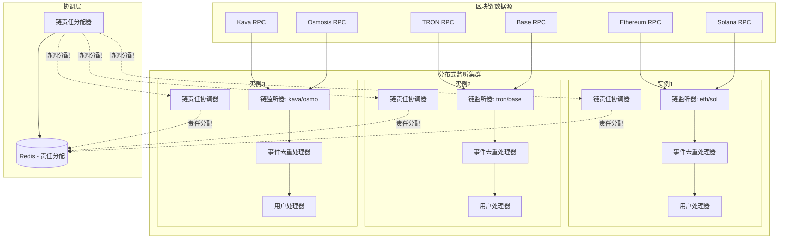
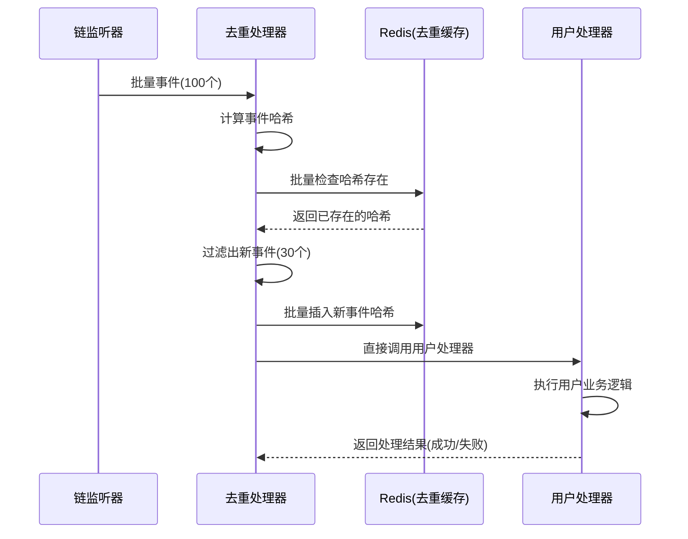
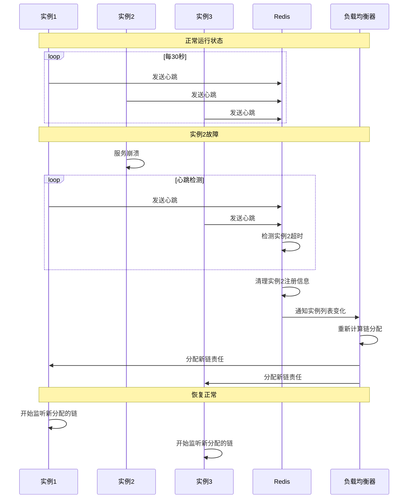

# 通用多链分布式监听器 SDK 架构设计

## 项目背景与目标

### SDK定位
本方案设计一个通用的多链分布式监听器，作为可复用的SDK提供多链监听能力。该SDK专注于区块链事件的异步监听与数据处理，为不同业务场景提供灵活的解决方案。

### 核心价值
- **通用性**：支持主流区块链网络，可通过配置快速适配新链
- **高可用**：分布式架构，支持故障转移和负载均衡
- **易集成**：提供简化和高级两种接入方案，满足不同复杂度需求 
- **可扩展**：模块化设计，支持自定义事件处理器

### 特性
- **异步非阻塞**：基于asyncio设计，不阻塞用户其他任务，支持在同一应用中集成多个服务
- **事件驱动**：通过回调函数将事件传递给用户处理器，处理器返回值控制重试策略
- **智能去重**：多层次去重策略（内存+分布式），避免重复处理相同事件
- **故障自愈**：自动检测实例故障，重新分配监听责任，确保高可用性
- **负载均衡**：基于链权重和实例负载的智能任务分配
- **平滑扩展**：从单实例到多实例的平滑升级，无需修改业务代码
- **配置灵活**：约定大于配置，提供合理默认值，支持渐进式配置


## 核心配置架构

### SDK依赖的外部客户端
- **aioredis**：用于分布式去重和协调，若不需去重可不使用
- **motor**：用于储存区块进度（异步MongoDB驱动）

### 依赖设计原则
- SDK不直接初始化数据库连接
- 用户创建client实例后注册到SDK
- 支持不同部署模式（单实例、哨兵、集群等）

### 1. 链配置模板（关键提炼）

```yaml
# blockchain_config_template.yaml
blockchains:
  ethereum:
    enabled: true
    network: "mainnet"  # mainnet/testnet/devnet
    weight: 3           # 负载权重，影响实例分配
    confirmations: 12   # 确认区块数
    polling:
      enabled: true
      interval: 15      # 轮询间隔(秒)
      batch_size: 100   # 批量处理大小
    rpc:
      urls:
        - "https://mainnet.infura.io/v3/xxx"
        - "https://eth-mainnet.alchemyapi.io/v2/xxx"
      timeout: 30
      retries: 3
      strategy: "round_robin"  # round_robin/failover/random
    contracts:
      - name: "WBTCFactory"
        address: "0x..."
        abi_path: "./abis/wbtc_factory.json"
        events:
          - "BurnRequest"
          - "MintRequest"
    filters:
      from_block: "latest"  # latest/number/auto
      to_block: "latest"

  solana:
    enabled: true
    network: "mainnet"
    weight: 2
    polling:
      enabled: true
      interval: 10
    rpc:
      urls:
        - "https://api.mainnet-beta.solana.com"
    programs:
      - name: "WBTCProgram"
        address: "11111111111111111111111111111111"
        accounts:
          - "wbtc_vault"
          - "mint_authority"

# 新链可以通过复制此模板快速接入
```

### 2. 分布式配置

```yaml
# distributed_config.yaml
cluster:
  instance_id: "${INSTANCE_ID:listener-01}"
  instance_group: "wbtc-listener-group"

coordination:

  leader_election:
    enabled: true
    ttl: 30
    lock_timeout: 60

load_balancing:
  strategy: "weighted"  # weighted/round_robin
  rebalance_interval: 300  # 5分钟重平衡
  health_check_interval: 30
```

### 3. 存储配置

```yaml
# storage_config.yaml - 用户配置，不直接创建连接
storage:
  mongodb:
    # 用户需要创建Motor client并注册到SDK
    database: "blockchain_progress"
    collections:
      progress: "listener_progress"
      instances: "active_instances"
      # 注意：事件存储由用户处理器控制，SDK不存储事件数据

  redis:
    # 用户需要创建aioredis client并注册到SDK
    cache_ttl: 3600    # 1小时
    event_cache_ttl: 300  # 5分钟
    cache_key_prefix: "block_data_cache_"
    # 注意：用于去重和协调，不存储事件数据
```

### 4. 事件处理配置

```yaml
# event_processing.yaml
event_processing:
  deduplication:
    strategy: "multi_layer"  # multi_layer/single/db
    cache_size: 10000
    ttl: 3600
```

**决策说明：基于轮询的优化方案，支持多链分布式监听**

通过深入分析，我们选择了轮询监听的优化方案，结合多实例协调和数据库去重机制，实现高可用的多链事件监听系统。

#### 4.1.1 整体架构图



#### 4.1.2 多链负载均衡策略

**按链权重分配：**
- Ethereum: 权重3（事件频繁，需要更多实例）
- Solana/Base: 权重2（中等频率）
- TRON/Kava/Osmosis: 权重1（低频率）

**实例职责分配算法：**
```python
# 基于权重的链分配
def assign_chain_responsibilities(instance_id: str, total_instances: int) -> List[str]:
    chain_weights = {"eth": 3, "sol": 2, "base": 2, "tron": 1, "kava": 1, "osmosis": 1}
    instance_index = get_instance_index(instance_id)

    assigned_chains = []
    total_weight = sum(chain_weights.values())
    current_weight_sum = 0

    for chain_name, weight in chain_weights.items():
        # 计算该链需要的实例数量
        chain_instance_count = max(1, int(total_instances * weight / total_weight))

        # 环形分配给实例
        if instance_index in get_assigned_instance_range(current_weight_sum, chain_instance_count, total_instances):
            assigned_chains.append(chain_name)

        current_weight_sum += chain_instance_count

    return assigned_chains
```

#### 4.1.3 任务分配和协调机制

**核心目标：确保每条链至少有一个实例在监听**

1. **链责任分配**：每条链分配给一个或多个实例负责监听
2. **避免重复监听**：防止多个实例监听同一条链，浪费资源
3. **故障转移**：负责某条链的实例故障时，自动重新分配给其他实例

```python
# 链分配协调器伪代码
class ChainAssignmentCoordinator:
    async def assign_chain_responsibilities(self) -> Dict[str, List[str]]:
        """为实例分配监听责任"""
        active_instances = await self.get_active_instances()
        chain_configs = await self.get_chain_configs()

        assignments = {}
        for chain_name, chain_config in chain_configs.items():
            # 根据链权重和实例权重分配监听责任
            assigned_instances = self._calculate_chain_assignment(
                chain_name, chain_config, active_instances
            )
            assignments[chain_name] = assigned_instances

            # 将分配结果存储到Redis
            await redis.hset(
                "chain_assignments",
                chain_name,
                json.dumps(assigned_instances)
            )

        return assignments

    def _calculate_chain_assignment(self, chain_name: str,
                                  chain_config: Dict,
                                  instances: List[Dict]) -> List[str]:
        """计算某条链应该由哪些实例监听"""
        required_instances = chain_config.get("required_instances", 1)

        # 基于实例权重选择监听实例
        sorted_instances = sorted(
            instances,
            key=lambda x: x.get("weight", 1),
            reverse=True
        )

        return [inst["id"] for inst in sorted_instances[:required_instances]]

    async def is_my_responsibility(self, instance_id: str, chain_name: str) -> bool:
        """检查当前实例是否需要监听指定链"""
        assignment_data = await redis.hget("chain_assignments", chain_name)
        if not assignment_data:
            return False

        assigned_instances = json.loads(assignment_data)
        return instance_id in assigned_instances
```

### 4.2 事件去重和分发机制

#### 4.2.1 多层次去重策略

**第一层：内存去重**
- 在单次轮询中去除重复事件

**第二层：分布式缓存去重**
- 使用Redis存储最近处理的事件哈希
- TTL为1小时，防止短期重复处理

#### 4.2.2 事件哈希算法

```python
def calculate_event_hash(event: dict) -> str:
    """确保事件唯一性的哈希算法"""
    hash_data = {
        "txHash": event["transactionHash"],
        "logIndex": event["logIndex"],
        "blockNumber": event["blockNumber"],
        "chainName": event["chainName"],
        "eventSignature": event["eventSignature"]
    }
    hash_string = json.dumps(hash_data, sort_keys=True)
    return hashlib.sha256(hash_string.encode()).hexdigest()
```

#### 4.2.3 事件分发架构



### 4.3 进度持久化和实例协调机制

#### 4.3.1 进度持久化策略

**双重存储设计：**
- **Redis缓存**：快速访问，TTL为1小时
- **MongoDB持久化**：长期存储，服务重启后恢复

```python
# 监听进度管理器
class ListenerProgressManager:
    def __init__(self, redis_client, mongodb_client):
        self.redis = redis_client
        self.mongo = mongodb_client

    async def get_last_processed_block(self, chain_name: str) -> int:
        """获取最后处理的区块号"""
        redis_key = f"listener_progress:{chain_name}"

        # 优先从Redis获取
        cached_block = await self.redis.get(redis_key)
        if cached_block:
            return int(cached_block)

        # Redis没有则从MongoDB获取
        progress = await self.mongo.listener_progress.find_one(
            {"chainName": chain_name}
        )

        if progress:
            # 同步到Redis缓存
            await self.redis.setex(redis_key, 3600, progress["lastProcessedBlock"])
            return progress["lastProcessedBlock"]

        # 首次启动，从配置获取起始区块
        return await self.get_start_block(chain_name)

    async def update_last_processed_block(self, chain_name: str, block_number: int):
        """更新最后处理的区块号"""
        redis_key = f"listener_progress:{chain_name}"

        # 更新Redis缓存
        await self.redis.setex(redis_key, 3600, block_number)

        # 更新MongoDB持久化
        await self.mongo.listener_progress.update_one(
            {"chainName": chain_name},
            {
                "$set": {
                    "lastProcessedBlock": block_number,
                    "updatedAt": datetime.utcnow()
                }
            },
            upsert=True
        )
```

#### 4.3.2 实例协调机制

**实例注册和心跳：**
```python
# 实例协调器
class InstanceCoordinator:
    def __init__(self, redis_client, instance_id: str):
        self.redis = redis_client
        self.instance_id = instance_id
        self.heartbeat_interval = 30
        self.instance_timeout = 90

    async def register_instance(self):
        """注册实例"""
        instance_info = {
            "instanceId": self.instance_id,
            "registeredAt": timestamp(),
            "lastHeartbeat": timestamp(),
            "status": "active",
            "version": "v1.0"
        }

        await self.redis.hset(
            "active_instances",
            self.instance_id,
            json.dumps(instance_info)
        )

    async def send_heartbeat(self):
        """发送心跳"""
        heartbeat_data = {
            "instanceId": self.instance_id,
            "lastHeartbeat": timestamp(),
            "status": "active",
            "currentWorkload": await self.get_current_workload()
        }

        await self.redis.hset(
            "active_instances",
            self.instance_id,
            json.dumps(heartbeat_data)
        )

    async def get_active_instances(self) -> List[str]:
        """获取活跃实例列表"""
        instances_data = await self.redis.hgetall("active_instances")
        active_instances = []

        for instance_id, info_json in instances_data.items():
            try:
                info = json.loads(info_json)
                last_heartbeat = info["lastHeartbeat"]

                # 检查心跳是否超时
                if timestamp() - last_heartbeat < self.instance_timeout:
                    active_instances.append(instance_id)
                else:
                    # 清理超时实例
                    await self.redis.hdel("active_instances", instance_id)

            except (json.JSONDecodeError, KeyError):
                await self.redis.hdel("active_instances", instance_id)

        return active_instances
```

#### 4.3.3 故障检测和恢复机制



#### 4.3.4 动态重平衡机制

```python
# 动态重平衡管理器
class DynamicRebalanceManager:
    def __init__(self, redis_client):
        self.redis = redis_client
        self.rebalance_interval = 300  # 5分钟检查一次
        self.load_threshold = 0.8     # 负载阈值

    async def monitor_and_rebalance(self):
        """监控并重平衡负载"""
        while True:
            try:
                # 收集各链负载统计
                chain_loads = await self.collect_chain_loads()

                # 识别需要重平衡的链
                unbalanced_chains = self.identify_unbalanced_chains(chain_loads)

                if unbalanced_chains:
                    # 计算新的分配方案
                    new_assignment = await self.calculate_optimal_assignment(
                        unbalanced_chains,
                        await self.get_active_instances()
                    )

                    # 应用新的分配方案
                    await self.apply_new_assignment(new_assignment)

                await asyncio.sleep(self.rebalance_interval)

            except Exception as e:
                logger.error(f"Rebalance error: {e}")
                await asyncio.sleep(60)
```

### 4.4 事件监听器设计

```python
# 多链分布式监听器实现
class MultiChainDistributedListener:
    def __init__(self, instance_id: str, redis_client):
        self.instance_id = instance_id
        self.redis = redis_client
        self.chain_listeners = {}
        self.rpc_coordinator = RPCCoordinator(redis_client)
        self.progress_manager = ListenerProgressManager(redis_client, mongodb_client)
        self.instance_coordinator = InstanceCoordinator(redis_client, instance_id)

    async def start_listening(self):
        """启动分布式监听"""
        # 注册实例
        await self.instance_coordinator.register_instance()

        # 获取分配的区块链
        assigned_chains = await self.get_assigned_chains()

        # 为每条链创建监听器
        for chain_name in assigned_chains:
            listener = ChainListener(
                instance_id=self.instance_id,
                chain_name=chain_name,
                rpc_coordinator=self.rpc_coordinator,
                progress_manager=self.progress_manager
            )
            self.chain_listeners[chain_name] = listener
            asyncio.create_task(listener.start_listening())

        # 启动心跳
        asyncio.create_task(self.instance_coordinator.heartbeat_loop())

# 链监听器核心逻辑
class ChainListener:
    def __init__(self, instance_id: str, chain_name: str, rpc_coordinator, progress_manager):
        self.instance_id = instance_id
        self.chain_name = chain_name
        self.rpc_coordinator = rpc_coordinator
        self.progress_manager = progress_manager
        self.polling_interval = 15

    async def start_listening(self):
        """启动单链轮询监听"""
        while True:
            try:
                # 获取最新区块（通过RPC协调器）
                current_block = await self.rpc_coordinator.get_chain_latest_block(self.chain_name)
                last_block = await self.progress_manager.get_last_processed_block(self.chain_name)

                if current_block > last_block:
                    # 处理新区块
                    from_block = last_block + 1
                    to_block = current_block - self.get_confirmations()

                    if from_block <= to_block:
                        events = await self.rpc_coordinator.get_chain_events(
                            self.chain_name, from_block, to_block
                        )

                        # 去重并处理事件
                        unique_events = await self.deduplicate_events(events)
                        await self.process_events(unique_events)

                        # 更新进度
                        await self.progress_manager.update_last_processed_block(
                            self.chain_name, to_block
                        )

                await asyncio.sleep(self.polling_interval)

            except Exception as e:
                logger.error(f"Chain listening error for {self.chain_name}: {e}")
                await asyncio.sleep(30)
```

### 4.5 数据处理流程

```python
# 事件处理示例（用户实现）
from services.cross_chain_service import CrossChainService
from database.mongodb import get_database
import logging

logger = logging.getLogger(__name__)

async def process_ethereum_event(chain_name: str, event_type: str, event_data: dict):
    """处理以太坊事件（用户处理器示例）"""
    try:
        # 获取数据库连接
        db = get_database()

        # 初始化服务
        cross_chain_service = CrossChainService(db)

        # 解析事件数据
        parsed_event = parse_ethereum_event(event_type, event_data)

        # 识别操作类型
        order_type = identify_order_type(parsed_event, chain_name)

        # 创建订单记录
        order = await create_order_record(
            order_type=order_type,
            chain_name=chain_name,
            event_data=parsed_event
        )

        # 如果是跨链操作，进行特殊处理
        if "cross_chain" in order_type:
            await cross_chain_service.process_cross_chain_event(order)

        logger.info(f"Processed {order_type} event: {order['_id']}")
        return True  # 处理成功

    except Exception as exc:
        logger.error(f"Failed to process event: {str(exc)}")
        return False  # 触发SDK重试

def identify_order_type(event_data: dict, chain_name: str) -> str:
    """识别订单类型"""
    requester = event_data.get("requester", "")

    # 检查是否为跨链地址（需要外部数据或配置）
    if is_cross_chain_address(requester, chain_name):
        event_type = event_data.get("eventType", "")
        if "Burn" in event_type:
            return "cross_chain_burn"
        elif "Mint" in event_type:
            return "cross_chain_mint"
    else:
        event_type = event_data.get("eventType", "")
        if "Burn" in event_type:
            return "burn"
        elif "Mint" in event_type:
            return "mint"

    return "unknown"

async def create_order_record(order_type: str, chain_name: str, event_data: dict) -> dict:
    """创建订单记录 - 兼容老系统Order表结构"""
    from datetime import datetime
    from bson import ObjectId
    from biganumber import BigNumber

    # 兼容老系统的字段命名和数据类型
    order = {
        "_id": ObjectId(),

        # 老系统Order表必需字段
        "token": "wbtc",                           # 固定值，与老系统一致
        "type": order_type,                        # TransactionType: mint, burn, etc.
        "amount": str(event_data.get("amount", 0)), # 字符串形式的BigNumber，确保精度
        "requestingMerchant": ObjectId("000000000000000000000000"),  # 默认值，实际需要从merchant系统获取
        "status": "pending",                       # RequestState
        "date": datetime.utcnow(),                 # 最后更新时间，与老系统命名一致
        "history": [],                              # 交易历史数组
        "notificationSent": False,                 # 与老系统一致
        "tokenSpecific": {},                       # 代币特定数据

        # 新增字段
        "chainName": chain_name,

        # 交易信息
        "transactionInfo": {
            "transactionHash": event_data.get("transactionHash"),
            "requestHash": event_data.get("requestHash"),
            "requester": event_data.get("requester"),
            "btcTxid": event_data.get("btcTxid"),
            "blockNumber": event_data.get("blockNumber"),
            "blockTimestamp": event_data.get("blockTimestamp", datetime.utcnow()),
            "from": event_data.get("from"),
            "to": event_data.get("to"),
            "action": "pending",                    # RequestState
        },

        "createdAt": datetime.utcnow(),
        "updatedAt": datetime.utcnow(),
        "metadata": {
            "eventSource": "blockchain_listener",
            "processedVersion": "v1.0",
            "rawEvent": event_data
        }
    }

    # 存储到数据库
    db = get_database()
    await db.wbtc_operations.insert_one(order)

    # 创建兼容老系统Transaction格式的history记录
    transaction_record = {
        "token": "wbtc",
        "txid": event_data.get("transactionHash"),
        "chain": chain_name,
        "from": event_data.get("from"),
        "to": event_data.get("to"),
        "blockHeight": event_data.get("blockNumber"),
        "amount": str(event_data.get("amount", 0)), # 字符串形式的BigNumber
        "type": order_type,
        "date": datetime.utcnow(),
        "action": "asset",                         # RequestState，与老系统一致
        "order": order["_id"]                      # 关联Order
    }

    # 创建事件记录（新功能）
    event_record = {
        "_id": ObjectId(),
        "eventId": f"evt_{datetime.utcnow().timestamp()}",
        "orderId": str(order["_id"]),              # 关联订单ID
        "eventType": event_data.get("eventType"),
        "chainName": chain_name,
        "contractAddress": event_data.get("contractAddress"),
        "eventParams": event_data.get("params", {}),
        "blockchainInfo": {
            "transactionHash": event_data.get("transactionHash"),
            "blockNumber": event_data.get("blockNumber"),
            "blockHash": event_data.get("blockHash"),
            "transactionIndex": event_data.get("transactionIndex", 0),
            "logIndex": event_data.get("logIndex", 0),
        },
        "processingInfo": {
            "processedAt": datetime.utcnow(),
            "status": "success",
            "retryCount": 0
        },
        "rawLogData": event_data.get("rawLog")
    }

    # 将交易记录添加到history数组
    order["history"].append(transaction_record)

    # 更新订单记录
    await db.orders.update_one(
        {"_id": order["_id"]},
        {"$set": {"history": order["history"]}}
    )

    await db.order_events.insert_one(event_record)

    return order
```

## SDK 接入方案设计

### 设计原则

**约定大于配置**：提供合理的默认值，减少用户配置负担
**渐进增强**：支持从极简到复杂的平滑升级
**事件驱动**：通过回调函数将事件传递给用户处理器

## 统一的用户代码接口

**设计理念**：两种模式使用相同的用户代码，差异仅在配置和监听器类

### 用户处理器代码（两种模式通用）

```python
# main.py - 两种模式都可以使用相同的业务逻辑
from blockchain_listener import QuickListener, DistributedListener

# 1. 定义事件处理器（用户必须实现）
def handle_transfer(event):
    """处理Transfer事件"""
    print(f"检测到转账: {event['from']} -> {event['to']}, 金额: {event['value']}")

    # 用户自行决定如何存储和处理
    # save_to_database(event)
    # send_notification(event)
    return True  # 处理成功

def handle_burn(event):
    """处理Burn事件"""
    print(f"检测到销毁: {event['from']}, 金额: {event['value']}")
    # 用户业务逻辑
    return True

# 2. 合约和事件注册（两种模式相同）
def register_contracts(listener):
    """注册合约和事件处理器"""
    return listener.add_contract(
        chain='ethereum',
        address='0x2260FAC5E5542a773Aa44fBCfeDf7C193bc2C599',  # WBTC地址
        rpc_url='https://eth.llamarpc.com'
    ).on_event('Transfer', handle_transfer) \
     .on_event('Burn', handle_burn)

# 3. 启动函数（根据环境选择不同监听器类）
async def start_simple_mode():
    """启动极简模式（异步非阻塞）"""
    # 从配置文件加载
    listener = QuickListener.from_config("simple_config.yaml")
    register_contracts(listener)

    # 启动监听（返回任务，不阻塞）
    listener_task = await listener.start_async()
    return listener_task

async def start_distributed_mode():
    """启动分布式模式（异步非阻塞）"""
    # 从配置文件加载
    listener = DistributedListener.from_config("production_config.yaml")

    # 注册MongoDB客户端（Motor）
    from motor.motor_asyncio import AsyncIOMotorClient
    mongodb_client = AsyncIOMotorClient("mongodb://localhost:27017")
    listener.register_mongodb_client(mongodb_client)

    # 注册Redis客户端（aioredis）
    import aioredis
    redis_client = aioredis.from_url("redis://localhost:6379/0")
    listener.register_redis_client(redis_client)

    # 注册合约和事件
    register_contracts(listener)

    # 启动分布式协调（返回任务，不阻塞）
    listener_task = await listener.start_distributed_async()
    return listener_task

async def main():
    """主函数 - 用户可以在同一个应用中处理其他任务"""
    # 启动监听器
    listener, listener_task = await start_simple_mode()  # 或 start_distributed_mode()

    # 用户可以同时处理其他任务
    print("监听器已启动，开始处理其他业务逻辑...")

    # 示例：处理其他业务任务
    while True:
        await asyncio.sleep(10)
        print(f"处理其他业务任务... {datetime.now()}")

        # 检查监听器状态
        status = await listener.get_status()
        print(f"监听器状态: {status}")

# 4. 根据环境变量选择启动模式
import os
import asyncio
from datetime import datetime

async def run_listener():
    """运行监听器的入口函数"""
    if os.getenv("DISTRIBUTED_MODE") == "true":
        return await start_distributed_mode()
    else:
        return await start_simple_mode()

# 启动应用
if __name__ == "__main__":
    asyncio.run(main())

# 旧版本启动方式（已废弃，仅用于对比）
# if os.getenv("DISTRIBUTED_MODE") == "true":
#     asyncio.run(start_distributed_mode())
# else:
#     start_simple_mode()
```

### 事件数据结构（两种模式通用）

```python
# 用户处理器接收到的事件数据结构
{
    "event_type": "Transfer",           # 事件类型
    "contract_address": "0x...",       # 合约地址
    "chain_name": "ethereum",          # 链名称
    "transaction_hash": "0x...",       # 交易哈希
    "block_number": 18500000,          # 区块号
    "block_timestamp": 1640000000,     # 区块时间
    "log_index": 5,                    # 日志索引
    "from": "0x...",                   # 发送者
    "to": "0x...",                     # 接收者
    "value": "1000000000000000000",    # 金额（字符串，保持精度）
    "raw_event": {...}                 # 原始事件数据
}
```

### 错误处理和重试（两种模式通用）

```python
# 处理器函数可以通过返回值控制重试
def handle_event_with_retry(event):
    try:
        # 用户业务逻辑
        process_business_logic(event)
        print(f"✅ 成功处理事件: {event['transaction_hash']}")
        return True  # 处理成功，不重试
    except Exception as e:
        print(f"❌ 处理失败: {e}")
        return False  # 触发SDK重试机制

# 在注册合约时使用
listener = QuickListener(event_retry=3, retry_delay=5)
register_contracts(listener).on_event('Transfer', handle_event_with_retry)
```

### 客户端配置示例（分布式模式）

```python
# clients_config.py - 数据库客户端配置示例
import os
from motor.motor_asyncio import AsyncIOMotorClient
import aioredis

def create_mongodb_client():
    """创建MongoDB客户端（Motor）"""
    # 方式1：直连MongoDB
    return AsyncIOMotorClient("mongodb://localhost:27017")

def create_mongodb_client_from_uri():
    """从URI创建MongoDB客户端"""
    uri = os.getenv('MONGODB_URI', 'mongodb://localhost:27017')
    return AsyncIOMotorClient(uri)

def create_mongodb_client_with_auth():
    """带认证的MongoDB客户端"""
    return AsyncIOMotorClient(
        host=os.getenv('MONGODB_HOST', 'localhost'),
        port=int(os.getenv('MONGODB_PORT', 27017)),
        username=os.getenv('MONGODB_USERNAME'),
        password=os.getenv('MONGODB_PASSWORD'),
        authSource=os.getenv('MONGODB_AUTH_SOURCE', 'admin')
    )

def create_redis_client():
    """创建Redis客户端（aioredis）"""
    # 方式1：基本连接
    return aioredis.from_url("redis://localhost:6379/0")

def create_redis_client_with_password():
    """带密码的Redis客户端"""
    password = os.getenv('REDIS_PASSWORD')
    return aioredis.from_url(f"redis://:{password}@localhost:6379/0")

def create_redis_cluster_client():
    """Redis集群客户端"""
    return aioredis.RedisCluster.from_url("redis://localhost:6379/0")

async def register_clients(listener):
    """注册所有客户端到监听器"""
    # 注册MongoDB客户端（用于进度存储）
    mongodb_client = create_mongodb_client()
    listener.register_mongodb_client(mongodb_client)

    # 注册Redis客户端（用于去重和协调）
    redis_client = create_redis_client_with_password()
    listener.register_redis_client(redis_client)

# 使用示例
async def setup_distributed_listener():
    """完整的分布式监听器设置（异步非阻塞）"""
    # 从配置文件创建监听器
    listener = DistributedListener.from_config("production_config.yaml")

    # 注册客户端
    await register_clients(listener)

    # 注册合约和事件处理器
    register_contracts(listener)

    # 异步启动监听（非阻塞，返回任务）
    listener_task = await listener.start_distributed_async()
    return listener, listener_task

async def full_application_example():
    """完整应用示例 - 监听器 + 其他业务"""
    # 启动分布式监听器
    listener, listener_task = await setup_distributed_listener()

    # 同时启动其他业务服务
    print("分布式监听器已启动，开始处理其他业务...")

    # 示例：用户可以同时运行API服务器、定时任务等
    from fastapi import FastAPI
    app = FastAPI()

    @app.get("/listener/status")
    async def listener_status():
        return await listener.get_cluster_status()

    @app.get("/listener/chains")
    async def chain_status():
        return await listener.get_chain_status()

    # 启动API服务器
    import uvicorn
    config = uvicorn.Config(app, host="0.0.0.0", port=8000)
    server = uvicorn.Server(config)
    await server.serve()

# 启动完整应用
if __name__ == "__main__":
    asyncio.run(full_application_example())
```

## 方案一：极简模式（Standalone）

**设计理念**：零第三方依赖，单机运行，异步非阻塞，事件驱动，用户处理

#### 异步启动方式

```python
# simple_main.py
import asyncio
from blockchain_listener import QuickListener
from main import register_contracts  # 导入通用的注册函数

async def main():
    # 1. 从配置文件创建监听器
    listener = QuickListener.from_config("simple_config.yaml")

    # 2. 注册合约和事件
    register_contracts(listener)

    # 3. 异步启动监听（非阻塞）
    listener_task = await listener.start_async()

    # 4. 用户可以同时处理其他任务
    print("区块链监听器已启动，开始处理其他业务...")

    # 示例：启动Web服务器
    from fastapi import FastAPI
    app = FastAPI()

    @app.get("/status")
    async def get_status():
        return await listener.get_status()

    # 运行其他服务
    import uvicorn
    config = uvicorn.Config(app, host="0.0.0.0", port=8000)
    server = uvicorn.Server(config)
    await server.serve()

# 启动应用
if __name__ == "__main__":
    asyncio.run(main())
```

#### 传统阻塞方式（可选）

```python
# blocking_main.py - 如果用户只需要监听器运行
from blockchain_listener import QuickListener
from main import register_contracts

# 1. 从配置文件创建监听器
listener = QuickListener.from_config("simple_config.yaml")

# 2. 注册合约和事件
register_contracts(listener)

# 3. 阻塞启动（仅监听器运行）
listener.start()  # 阻塞直到程序停止
```

#### 配置文件

```yaml
# simple_config.yaml - 极简模式配置
# 大部分配置都有默认值，用户只需配置必要的RPC和合约
blockchains:
  ethereum:
    enabled: true
    weight: 1
    polling:
      enabled: true
      interval: 15      # 轮询间隔(秒)
      batch_size: 100   # 批量处理大小
    rpc:
      urls:
        - "https://eth.llamarpc.com"  # 免费RPC
      timeout: 30
      retries: 3
    contracts:
      - address: "0x2260FAC5E5542a773Aa44fBCfeDf7C193bc2C599"  # WBTC
        events: ["Transfer", "Burn", "Mint"]

# 事件处理配置
event_processing:
  retry:
    max_retries: 3
    retry_delay: 5
  error_log: true

# 其他使用默认值：
# - 事件去重：内存去重
# - 日志：控制台输出
# - 无分布式协调
```

## 方案二：分布式模式（Distributed）

**设计理念**：分布式协调，负载均衡，事件驱动，用户处理，支持大规模生产环境

#### 分布式配置

```yaml
# production_config.yaml - 分布式生产环境配置
cluster:
  group: "wbtc-listener-prod"
  instance_id: "listener-01"
  zone: "us-east-1a"
  weight: 3  # 实例权重，影响负载分配

coordination:
  leader_election:
    enabled: true
    ttl: 30

# 高级事件处理配置
event_processing:
  # 分布式去重（基于事件哈希）
  deduplication:
    strategy: "distributed"  # local/distributed
    cache_size: 100000
    ttl: 3600

  # 负载均衡策略
  load_balancing:
    strategy: "weighted"  # weighted/round_robin/consistent_hash
    rebalance_interval: 300

  # 事件分发策略
  distribution:
    strategy: "event_hash"  # event_hash/round_robin/sticky
    retry_failed_events: true
```

#### 启动方式

```python
# distributed_main.py
from blockchain_listener import DistributedListener
from main import register_contracts  # 导入通用的注册函数

# 1. 创建分布式监听器
listener = DistributedListener.from_config("production_config.yaml")

# 2. 注册合约和事件（使用相同的注册函数）
register_contracts(listener)

# 3. 启动分布式协调
listener.start_distributed()
```

#### 多实例部署

```bash
# 实例1
INSTANCE_ID=listener-01 INSTANCE_WEIGHT=3 REDIS_PASSWORD=xxx python distributed_main.py

# 实例2
INSTANCE_ID=listener-02 INSTANCE_WEIGHT=3 REDIS_PASSWORD=xxx python distributed_main.py

# 实例3
INSTANCE_ID=listener-03 INSTANCE_WEIGHT=2 REDIS_PASSWORD=xxx python distributed_main.py

# 实例会自动：
# 1. 通过Redis发现彼此并协调分配监听责任
# 2. 确保每条链至少有一个实例在监听（避免重复监听）
# 3. 实例故障时，其负责的链自动重新分配给其他实例
# 4. 基于事件哈希进行跨实例去重（防止重复处理）
# 5. 所有实例都使用相同的用户处理器函数
```

#### 2.3 负载均衡和故障转移（SDK内置）

```python
# SDK自动处理的分布式逻辑
class DistributedCoordinator:
    """分布式协调器（SDK内置）"""

    def elect_leader(self):
        """选举Leader实例，负责任务分配"""

    def balance_load(self):
        """基于实例权重和链活跃度分配监听任务"""
        # - Ethereum: 高权重，多个实例监听
        # - Solana: 中等权重
        # - 其他链: 低权重，单实例监听

    def handle_failover(self, failed_instance):
        """故障实例的任务重新分配"""
        # 1. 从活跃列表移除故障实例
        # 2. 重新分配其监听的链
        # 3. 通知其他实例接管

    def deduplicate_events(self, event):
        """跨实例事件去重（基于事件哈希）"""
        # 使用Redis协调去重，避免重复处理
```

#### 2.4 分布式监控接口

```python
# 分布式状态查询（SDK提供）
listener = DistributedListener.from_config("production_config.yaml")

# 获取集群状态
cluster_status = listener.get_cluster_status()
print(f"活跃实例数: {cluster_status['active_instances']}")
print(f"当前Leader: {cluster_status['leader_instance']}")

# 获取各链监听状态
chain_status = listener.get_chain_status()
for chain, status in chain_status.items():
    print(f"{chain}: 当前区块 {status['current_block']}, 延迟 {status['lag']}s")

# 获取事件处理统计
event_stats = listener.get_event_stats()
print(f"总处理事件数: {event_stats['total_processed']}")
print(f"处理成功率: {event_stats['success_rate']}")

# 健康检查
health = listener.health_check()
if not health['healthy']:
    print(f"健康检查失败: {health['issues']}")
```

#### 2.5 多实例部署示例

```python
# 实例1启动命令
INSTANCE_ID=listener-01 INSTANCE_WEIGHT=3 REDIS_PASSWORD=xxx python distributed_main.py

# 实例2启动命令
INSTANCE_ID=listener-02 INSTANCE_WEIGHT=3 REDIS_PASSWORD=xxx python distributed_main.py

# 实例3启动命令
INSTANCE_ID=listener-03 INSTANCE_WEIGHT=2 REDIS_PASSWORD=xxx python distributed_main.py

# 实例会自动：
# 1. 通过Redis发现彼此并选举Leader
# 2. 协调分配监听任务（避免重复监听）
# 3. 处理故障转移和任务重分配
# 4. 跨实例事件去重
# 5. 所有事件仍调用用户处理器
```

### SDK API 设计

#### 核心接口

```python
# 两种模式共用的核心接口
class BaseListener:
    # 合约管理
    def add_contract(self, chain: str, address: str, **kwargs)
    def remove_contract(self, address: str)
    def list_contracts(self) -> List[Dict]

    # 事件处理
    def on_event(self, event_type: str, handler: Callable = None)
    def register_handler(self, event_type: str, handler: Callable)

    # 查询接口
    def get_events(self, **filters) -> List[Dict]
    def get_status(self) -> Dict

    # 控制（阻塞方式 - 可选）
    def start(self)  # 阻塞启动，仅监听器运行
    def stop(self)
    def pause(self)
    def resume(self)

    # 异步控制（推荐 - 非阻塞）
    async def start_async(self) -> asyncio.Task  # 异步启动，返回任务
    async def stop_async(self)

# 分布式模式特有接口
class DistributedListener(BaseListener):
    # 客户端注册
    def register_redis_client(self, client: aioredis.Redis)  # 注册Redis客户端
    def register_mongodb_client(self, client: AsyncIOMotorClient)  # 注册MongoDB客户端

    # 集群管理
    async def get_cluster_status(self) -> Dict
    async def get_chain_status(self) -> Dict
    async def health_check(self) -> Dict

    # 启动方式
    async def start_distributed(self)  # 阻塞启动（已废弃）
    async def start_distributed_async(self) -> asyncio.Task  # 异步启动（推荐）
```

### 方案对比总结

| 特性 | 极简模式 | 分布式模式 |
|------|----------|------------|
| **依赖** | 无外部依赖 | Redis（仅协调） |
| **部署** | 单机即可 | 支持多实例 |
| **存储** | 用户自定义 | 用户自定义 |
| **扩展性** | 垂直扩展 | 水平扩展 |
| **负载均衡** | 不支持 | 支持 |
| **故障转移** | 手动重启 | 自动故障转移 |
| **配置复杂度** | 零配置 | 中等配置 |
| **事件去重** | 内存去重 | 分布式去重 |
| **适用场景** | 开发测试、小规模应用 | 生产环境、大规模应用 |

### 核心架构差异

**极简模式架构**：
```
用户代码 → QuickListener → RPC节点 → 事件 → 用户处理器 → 用户存储
```

**分布式模式架构**：
```
用户代码 → DistributedListener → Redis协调 → RPC节点 → 事件 → 用户处理器 → 用户存储
                                    ↑
                               多实例协调
```

### 推荐选择

- **开发/测试阶段**：使用极简模式，快速验证想法
- **小规模生产**：可继续使用极简模式，配合进程监控
- **大规模生产**：升级到分布式模式，获得高可用和可扩展性
