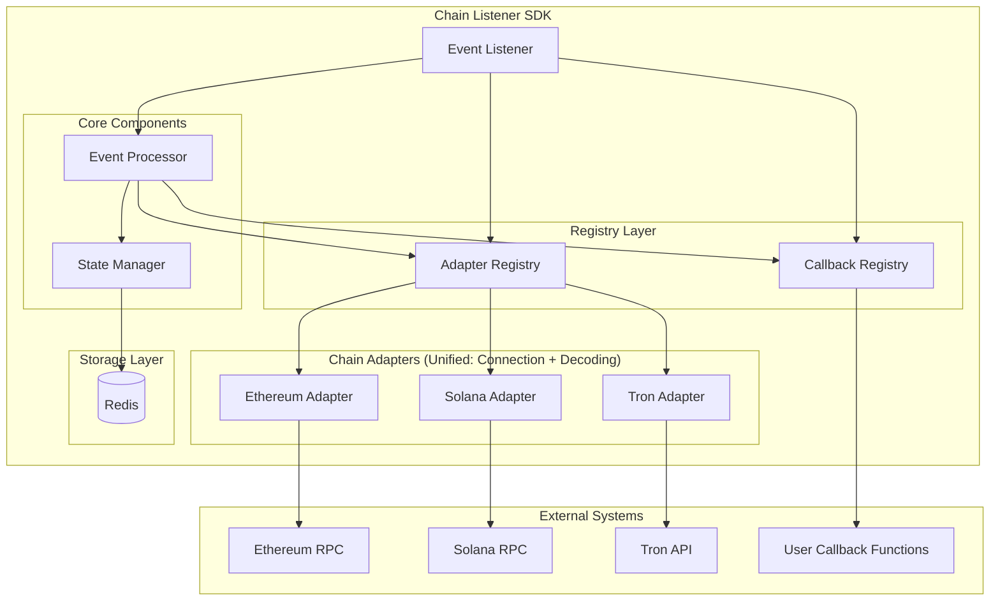
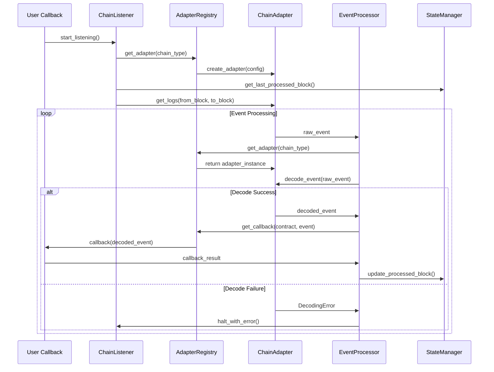

# Multi-Chain Event Listener SDK - Technical Solution

## System Architecture

### High-Level Architecture



### Core Component Design

#### 1. ChainListener (事件监听器 - 主API接口)
**核心职责**:
- 提供统一简洁的用户API接口
- 内部组合EventListener、EventProcessor、StateManager等组件
- 管理整个监听系统的生命周期和配置

**主要接口**:
```python
class ChainListener:
    def __init__(self, config: ChainListenerConfig)
    @classmethod
    def from_config_file(cls, config_path: str) -> 'ChainListener'

    # 生命周期管理
    async def start_listening(self) -> None
    async def stop_listening(self) -> None

    # 事件回调注册 - 用户友好API
    def on_event(self, chain_name: str, contract_address: str, event_name: str, callback: Callable) -> None

    # 系统管理
    async def get_system_status(self) -> Dict[str, Any]

    # 链管理
    async def get_latest_block(self, chain_name: str) -> int
```

**设计特点**:
- **门面模式**: 对外提供简洁统一的监听器API
- **组合模式**: 内部整合EventListener、EventProcessor、StateManager等专业组件
- **用户友好**: API名称和参数设计符合用户直觉
- **配置驱动**: 支持文件配置和代码配置两种方式

#### 2. EventListener (区块链事件监听器)
**核心职责**:
- 持续监听多条区块链的新区块和事件
- 管理与区块链节点的连接和轮询策略
- 检测网络异常和重连机制

**主要接口**:
```python
class EventListener:
    async def start_listening(self) -> None
    async def stop_listening(self) -> None
    async def add_chain(self, chain_type: ChainType, adapter: BaseAdapter) -> None
    async def remove_chain(self, chain_type: ChainType) -> None
    async def get_latest_block(self, chain_type: ChainType) -> int
    def is_listening(self, chain_type: ChainType) -> bool
```

**设计特点**:
- 专注于数据获取，不处理业务逻辑
- 支持多链并发监听
- 自动故障检测和恢复机制
- 智能轮询策略避免RPC超限

#### 3. AdapterRegistry (链适配器组册表)
**核心职责**:
- 管理不同区块链适配器的注册和获取
- 支持链类型映射和适配器复用
- 提供适配器生命周期管理

**主要接口**:
```python
class AdapterRegistry:
    def register_adapter(self, chain_type: ChainType, adapter_factory: Callable) -> None
    def get_adapter(self, chain_type: ChainType) -> BaseAdapter
```

**设计特点**:
- 单例模式确保全局唯一性
- 延迟初始化优化启动性能
- 线程安全的注册和查找操作

#### 5. EventProcessor (事件处理器)
**核心职责**:
- 协调事件解码、回调执行和状态管理
- 管理事件处理的错误处理和重试机制

**主要接口**:
```python
class EventProcessor:
    async def process_events(self, raw_events: List[RawEvent]) -> List[ProcessResult]
```

**设计特点**:
- 流水线处理模式提高吞吐量
- 异步并发处理支持高TPS
- 可配置的重试和降级策略

#### 5. ChainAdapter (区块链适配器)
**核心职责**:
- 负责与特定区块链的连接和数据获取
- 实现区块链特定的事件解码逻辑
- 提供统一的适配器接口供注册表管理

**主要接口**:
```python
class BaseAdapter:
    # 连接管理
    async def connect(self) -> None
    async def disconnect(self) -> None
    def is_connected(self) -> bool

    # 数据获取
    async def get_latest_block_number(self) -> int
    async def get_logs(
        self,
        address: Optional[Union[str, List[str]]],
        topics: Optional[List[str]],
        from_block: Optional[Union[int, str]],
        to_block: Optional[Union[int, str]]
    ) -> List[RawEvent]

    # 事件解码
    async def decode_event(self, raw_event: RawEvent) -> DecodedEvent

    # 链特定配置
    @property
    def chain_type(self) -> ChainType
    @property
    def config(self) -> ChainConfig
```

**职责划分最佳实践**:
- **BaseAdapter** 只负责跨链一致的轮询能力：RPC 连接与限流、`get_latest_block_number`、`get_logs` 等访问接口以及统一的错误处理。断点续传完全交由 `StateManager` 管理（记录最新成功区块号），并假定通过 RPC 获取的是已 final 的区块，因此无需再实现重组检测或区块哈希校验。
- **具体链 Adapter** 则承担链特定的结构化解析：如何调用链原生 API 拉取日志、如何将原始日志转换为 `RawEvent`、如何基于该链的 ABI/IDL 将事件解码成 `DecodedEvent`。如果需要缓存 ABI、做地址/数据格式转换，都在具体适配器内部完成。

`get_logs` 命名直接继承 EVM 语义（类似 `eth_getLogs`），表达“按地址 + 事件签名 + 区块范围”获取日志的含义。后续若要支持额外的过滤参数，可在方法入参上适配，而无需新增新的接口。

* **RawEvent** - 原始事件数据结构
```python
@dataclass
class RawEvent:
    chain_type: ChainType
    block_number: int
    block_hash: str
    transaction_hash: str
    log_index: int
    contract_address: str
    raw_data: Dict[str, Any]         # 链特定的原始数据
    timestamp: int
```

* **DecodedEvent** - 解码事件数据结构
```python
@dataclass
class DecodedEvent:
    chain_type: ChainType
    contract_address: str
    event_name: str
    parameters: Dict[str, Any]    # 解码后的事件参数
    block_number: int
    transaction_hash: str
    log_index: int
    timestamp: int
```

**具体实现**:
- **EthereumAdapter**: Web3.py集成，支持EVM兼容链
- **SolanaAdapter**: AsyncClient集成，Anchor IDL解码
- **TronAdapter**: HTTP客户端，TRC-20/TRC-721事件处理

**设计特点**:
- 统一接口抽象，支持多态操作
- 链类型映射机制，减少重复实现
- 内置连接池管理和故障恢复

#### 6. CallbackRegistry (回调注册表)
**核心职责**:
- 管理用户事件回调函数的注册和查找
- 基于"合约地址:事件名"的键值映射机制
- 支持回调函数的动态添加、移除和查询

**主要接口**:
```python
class CallbackRegistry:
    def register_callback(self, contract_address: str, event_name: str, callback: Callable) -> None
    def get_callback(self, contract_address: str, event_name: str) -> Optional[Callable]
    def remove_callback(self, contract_address: str, event_name: str) -> None
    def list_callbacks(self) -> Dict[str, Callable]
    def register_reorg_handler(self, handler: Callable) -> None
    def get_reorg_handler(self) -> Optional[Callable]
```

**设计特点**:
- 单例模式确保全局唯一性
- 高效的哈希表查找机制，O(1)时间复杂度
- 支持回调函数的版本管理和热更新
- 异常回调的隔离处理，不影响其他事件
- 线程安全的并发注册和调用
- 支持回调函数的优先级和分组

#### 7. StateManager (状态管理器)
**核心职责**:
- 统一管理区块处理状态和进度跟踪
- 提供存储后端的抽象接口

**主要接口**:
```python
class StateManager:
    async def save_block_state(self, state: BlockState) -> None
    async def get_latest_block(self, chain_type: ChainType) -> Optional[int]
```

---

#### 组件协作机制

##### 1. **事件数据流协作**
- **ChainListener** → **EventListener**: 从EventListener拿到raw event
- **EventListener** → **AdapterRegister**: 从AdapterRegister拿到所有链适配器，并开始事件监听
- **ChainListener** → **EventProcessor**: 原始事件传递和处理
- **EventProcessor** → **StateManager**: 处理状态同步和存储

##### 2. **生命周期协调**
- **启动顺序**: StateManager → AdapterRegistry → EventProcessor → EventListener
- **停止顺序**: EventListener → EventProcessor → AdapterRegistry → StateManager
- **优雅关闭**: 等待所有处理完成后再停止组件

##### 3. **配置级联管理**
- **用户配置** → ChainListener → 自动配置内部组件
- **不支持热重载支持**: 初始化时确定配置，不支持后续变更配置

##### 4. **错误处理协作**
- **EventListener错误** (连接失败、超限) → ChainListener决策重试/降级
- **EventProcessor错误** (解码失败、回调异常) → 记录日志并继续处理其他事件
- **StateManager错误** (存储失败) → 重试3次，期间打印错误日志。
- **错误传播机制**: 组件间错误传递和统一处理

##### 5. **性能和资源协调**
- **EventProcessor负载** → EventListener调整轮询频率
- **StateManager存储压力** → EventProcessor调整批处理大小
- **回调执行延迟** → EventProcessor动态调整并发数
- **内存使用监控** → 各组件自动调整缓存大小

##### 6. **状态同步机制**
- **实时状态同步**: 组件间定期交换健康状态和性能指标
- **配置一致性**: 确保所有组件使用相同的链配置和回调注册
- **进度协调**: EventListener的监听进度与EventProcessor的处理进度保持同步

##### 7. 时序图


### Usage Example

```python
# 加载配置
config = ChainListenerConfig.from_file("config.yaml")

# 创建监听器
listener = ChainListener(config)

# 注册事件回调
def handle_transfer(event):
    print(f"Transfer detected: {event.parameters}")

listener.on_event(
    chain_name="ethereum",
    contract_address="0xA0b86a33E6441E6C8D19A5E5E5E5E5E5E5E5E5E5",
    event_name="Transfer",
    callback=handle_transfer
)

listener.set_reorg_handler(handle_reorg)

# 启动监听
await listener.start()
```
---

## Adapter Design

采用注册表模式统一管理不同区块链适配器，支持动态扩展和链类型映射。

### 链类型适配策略

**兼容链映射机制**:
- **EVM兼容链** (Ethereum, Polygon): 共享以太坊适配器实例
- **独立链** (Solana, Tron): 使用专用适配器

### 适配器实现策略

#### EVM适配器（以太坊及兼容链）

**连接管理**:
- Web3.py HTTP客户端 + aiohttp连接池
- 自动重连和健康检查

**事件获取**:
- 使用eth_getLogs批量获取
- 按合约地址和事件签名过滤
- 智能分块处理避免RPC超时

**事件解码**:
- 预加载合约ABI到内存缓存
- 基于事件签名匹配解码器
- 异常事件跳过并记录日志

#### Solana适配器

**连接管理**:
- AsyncClient连接到Solana RPC
- 连接断开自动重连机制

**事件获取**:
- 按Program ID过滤事件
- 根据合约地址过滤
- 解析指令过滤出标准事件

**事件解码**:
- Anchor IDL加载和解析

#### Tron适配器

**连接管理**:
- 完全复用 BaseAdapter 的优先级连接池与限流器，通过 `_execute_with_rate_limit` 执行 TronGrid/FullNode HTTP RPC
- 仅轮询 final 区块数据，不再实现额外的订阅或重组检测逻辑

**区块/事件获取（轮询）**:
- `get_latest_block_number` 直接查询 TronGrid `wallet/getnowblock`，返回已确认区块号
- `get_logs` 调用 `v1/contracts/{address}/events`，结合 `event_name` 与 `block_number` 范围进行过滤，自动分页聚合，兼容 BaseAdapter 统一的 `from_block`/`to_block` 语义
- 所有监听进度由 `StateManager` 记录上一笔成功处理的区块高度，实现断点续传

**事件解码**:
- 由 TronAdapter 自行维护 ABI 缓存、事件签名映射与 Tron 特有数据格式（Base58 地址、SUN 精度值）转换
- 将处理后的结构化数据回传给 `EventProcessor`，保持与 EVM/Solana 统一的 `DecodedEvent` 结构

### 故障转移和轮询机制

#### 智能轮询策略
- **仅轮询最终状态**: 依托 RPC 返回的已确认区块高度决定 from/to block，StateManager 记录的 last processed block 负责断点续传
- **自适应间隔**: 根据RPC响应时间动态调整轮询频率
- **速率限制**: 遵守各链的API调用限制，避免429错误

#### RPC端点故障转移
- **自动切换**: 主节点失败时自动切换到备用节点
- **端点权重**: 支持配置不同节点的优先级

## EventProcessor Design

**处理流程**:
1. **日志轮询**: EventListener 按照最新区块高度调用各链适配器的 `get_logs`
2. **事件解码**: 调用链适配器将原始事件转换为结构化数据
3. **状态更新**: 记录成功处理的区块状态并触发回调路由

**错误处理策略**:
- **解码失败**: 跳过无法解码的事件，记录错误日志继续处理

---

## State Management & Persistence

状态管理采用分层设计，提供统一的存储抽象接口和多种存储后端实现。

### 核心数据结构

**BlockState** - 区块状态数据
```python
@dataclass
class BlockState:
    chain_type: ChainType
    block_number: int
    processed_at: int        # 处理时间戳
```

### 存储抽象层

**StorageBackend** - 纯技术存储抽象
```python
class StorageBackend:
    # 基础存储操作
    async def save(self, key: str, value: Any) -> None
    async def get(self, key: str) -> Optional[Any]
    async def delete(self, key: str) -> None
```

**StateManager** - 业务逻辑层（使用StorageBackend）
- 封装区块链状态管理的业务逻辑
- 提供业务语义的API给其他组件

**核心业务功能**:
- 进度跟踪：计算处理延迟和同步状态

### StorageBackend 具体实现

#### Redis Storage 
**实现策略**:
- 接收用户传入的异步Redis客户端实例
- 使用Redis Hash存储键值对数据，提高组织效率

**接口设计**:
```python
class RedisStorage(StorageBackend):
    def __init__(self, redis_client: aioredis.Redis, key_prefix: str = "chain_listener:"):

    async def save(self, key: str, value: Any) -> None:

    async def get(self, key: str) -> Optional[Any]:

    async def delete(self, key: str) -> None:
```

**使用示例**:
```python
import aioredis
from chain_listener.storages.redis import RedisStorage

# 用户创建和管理Redis客户端
redis_client = aioredis.Redis.from_url("redis://localhost:6379")

# 传入客户端给存储后端
storage = RedisStorage(redis_client, key_prefix="my_app:")

# ChainListener使用存储
listener.use_storage(redis_client)
```

---

## Configuration Management

### 单文件配置设计

采用YAML单配置文件设计，集成所有必要信息，包括链配置、存储设置和合约定义，最大化易用性和部署简便性。

#### 配置结构设计

**Global Settings** - 全局配置
- `max_concurrent_processing`: 最大并发处理数量
- `event_batch_size`: 事件批处理大小
- `callback_error_handling`: 错误处理策略 (ignore|retry|stop)
- `log_level`: 日志级别 (DEBUG|INFO|WARN|ERROR)

**Storage Configuration** - 存储配置
- `key_prefix`: key前缀

**Chain Configuration** - 链配置
```yaml
chains:
  ethereum:
    enabled: true
    chain_type: "ethereum"
    confirmation_blocks: 12
    polling_interval: 1000  # 毫秒
    rpc_urls:
      - url: "http://localhost:8545"
        priority: 1
      - url: "https://mainnet.infura.io/v3/xxx"
        priority: 2
    contracts:
      - name: "USDT"
        address: "0xdAC17F958D2ee523a2206206994597C13D831ec7"
        abi: "..."  # EVM合约ABI JSON字符串
        events: ["Transfer", "Approval"]
      - name: "CustomERC20"
        address: "0x..."
        abi: "..."
        events: ["Transfer"]

  solana:
    enabled: true
    chain_type: "solana"
    confirmation_blocks: 32
    polling_interval: 800
    rpc_urls:
      - url: "https://api.mainnet-beta.solana.com"
        priority: 1
    contracts:
      - name: "TokenProgram"
        program_id: "TokenkegQfeZyiNwAJbNbGKPFXCWuBvf9Ss623VQ5DA"
        idl: "..."  # Solana合约IDL JSON字符串
        events: ["Transfer", "Mint", "Burn"]

```

#### 配置模型设计

使用Pydantic进行类型安全的配置管理:

```python
class ChainListenerConfig(BaseModel):
    """主配置模型，支持类型验证和默认值"""
    version: str = "1.0"
    global: GlobalConfig
    storage: StorageConfig
    chains: Dict[str, ChainConfig]

    @classmethod
    def from_file(cls, file_path: str) -> 'ChainListenerConfig':
        """从YAML文件加载配置"""

    def get_enabled_chains(self) -> Dict[str, ChainConfig]:
        """获取启用的链配置"""

    def get_contracts_for_chain(self, chain_name: str) -> Dict[str, ContractConfig]:
        """获取指定链的合约配置"""
```

#### 配置验证规则
- **地址格式验证**: EVM地址、Solana Program ID、Tron地址
- **ABI/IDL JSON格式验证**: 确保数据格式正确
- **数值范围验证**: 轮询间隔、确认区块数等
- **必需字段验证**: 确保配置完整性

#### 配置加载机制

* **文件格式**: YAML格式，易于阅读和版本控制
* **预加载**: ChainListener初始化阶段加载配置
* **配置验证**: 加载时自动验证配置完整性和正确性

---

## Error Handling

### Enhanced Error Handling Strategy

```python
class ChainListenerError(Exception):
    """基础异常类"""
    pass

class EventProcessingError(ChainListenerError):
    """事件处理异常"""
    pass

class EventDecodingError(ChainListenerError):
    """事件解码失败"""
    pass

class ConnectionError(ChainListenerError):
    """连接异常"""
    pass

class ConfigError(ChainListenerError):
    """配置异常"""
    pass

class UnsupportedChainError(ChainListenerError):
    """不支持的链异常"""
    pass

class StorageError(ChainListenerError):
    """存储异常"""
    pass

class ErrorHandler:
    """错误处理器"""

    def __init__(self, max_retries: int = 3, backoff_factor: float = 2.0):
        self.max_retries = max_retries
        self.backoff_factor = backoff_factor

    async def handle_connection_error(self, error: Exception, attempt: int) -> bool:
        """处理连接错误，返回是否应该重试"""
        if attempt >= self.max_retries:
            return False

        # 指数退避
        delay = self.backoff_factor ** attempt
        await asyncio.sleep(delay)
        return True

    async def handle_rate_limit_error(self, headers: Dict[str, str]) -> float:
        """处理速率限制，返回需要等待的时间"""
        retry_after = headers.get('retry-after')
        if retry_after:
            try:
                return float(retry_after)
            except ValueError:
                pass

        # 默认退避策略
        return 5.0

    def classify_error(self, error: Exception) -> str:
        """错误分类"""
        if isinstance(error, SecurityError):
            return "security"
        elif isinstance(error, ConnectionError):
            return "connection"
        elif isinstance(error, DecodingError):
            return "decoding"
        else:
            return "unknown"
```

## Implementation Plan

### 🚀 敏捷里程碑规划

#### **Milestone 1: MVP Demo (Week 2)**
**目标**: 能监听单个以太坊合约的基础事件
- **用户价值**: 验证技术可行性，获得早期用户反馈，确立核心架构方向

#### **Milestone 2: Single Chain Production (Week 4)**
**目标**: 生产级的单链事件监听（以太坊）
- **用户价值**: 可在以太坊主网部署，支持真实业务场景，稳定可靠的事件处理

#### **Milestone 3: Multi-Chain Alpha (Week 6)**
**目标**: 支持EVM兼容链的多链监听
- **用户价值**: 一套代码支持多条链，降低多链部署成本，数据一致性保证

#### **Milestone 4: Feature Complete Beta (Week 8)**
**目标**: 支持全部4条链的完整功能
- **用户价值**: 全链覆盖的监听解决方案，满足复杂业务需求，企业级稳定性

#### **Milestone 5: Production Ready (Week 10)**
**目标**: 生产就绪的完整SDK
- **用户价值**: 可直接用于生产环境，运维友好的工具链，安全可靠保障

---

### 📋 Sprint 实施计划

此计划涵盖从基础架构搭建到生产级多链发布的完整周期（Sprint 1-10）。

---

#### 🚀 Phase 1: Foundation & MVP Demo (Week 1-2)

**Sprint 1 (Week 1): 核心基础**

* **核心任务:**
    1.  **项目架构搭建**
        * 依赖管理和构建系统
        * 基础目录结构
        * CI/CD 管道
    2.  **核心模型定义**
        * RawEvent, DecodedEvent
        * ChainType 枚举
        * 基础异常类
    3.  **最小以太坊适配器**
        * Web3.py 基础连接
        * 简单事件获取
        * 基础事件解码

> **🏁 里程碑检查:**
> * ✅ 能连接以太坊节点
> * ✅ 能获取简单 Transfer 事件

**Sprint 2 (Week 2): MVP Demo**

* **核心任务:**
    1.  **回调注册表基础版**
        * 简单的键值映射
        * 基础回调调用
    2.  **ChainListener 基础版**
        * 简单的事件循环
        * 基础错误处理
    3.  **MVP 演示程序**
        * 监听 USDT Transfer 事件
        * 简单的控制台输出

> **🏁 里程碑检查:**
> * ✅ 可工作的以太坊事件监听演示
> * ✅ 里程碑 1 交付完成

---

#### 📦 Phase 2: Single Chain Production (Week 3-4)

**Sprint 3 (Week 3): 存储和配置**

* **核心任务:**
    1.  **StorageBackend 抽象层**
        * 5 个核心接口定义
        * Redis 基础实现
    2.  **StateManager 业务层**
        * 区块状态管理
    3.  **配置管理系统**
        * Pydantic 配置模型
        * YAML 文件加载

> **🏁 里程碑检查:**
> * ✅ Redis 状态存储工作
> * ✅ 配置文件可加载

**Sprint 4 (Week 4): 生产级单链**

* **核心任务:**
    1.  **完整以太坊适配器**
        * 连接池管理
        * 完整错误处理
        * 性能优化
    2.  **完整回调注册表**
        * 异常隔离
        * 并发安全
    3.  **基础监控**
        * 健康检查端点
        * 基础日志记录

> **🏁 里程碑检查:**
> * ✅ 可在以太坊主网部署
> * ✅ 里程碑 2 交付完成

---

#### 🔗 Phase 3: Multi-Chain Alpha (Week 5-6)

**Sprint 5 (Week 5): 多链适配器**

* **核心任务:**
    1.  **BaseAdapter 抽象化**
        * 统一接口定义
        * 链类型映射
    2.  **适配器注册表**
        * 动态注册机制
        * 多链管理

> **🏁 里程碑检查:**
> * ✅ 适配器框架可扩展

**Sprint 6 (Week 6): 多链协调**

* **核心任务:**
    1.  **多链配置管理**
        * 链特定配置
        * 批量配置加载
    2.  **性能监控**
        * 多链指标面板
        * 处理延迟统计

> **🏁 里程碑检查:**
> * ✅ 多链同时监听工作
> * ✅ 里程碑 3 交付完成

---

#### ⚡ Phase 4: Feature Complete Beta (Week 7-8)

**Sprint 7 (Week 7): 异构链支持**

* **核心任务:**
    1.  **Solana 适配器**
        * AsyncClient 集成
        * Anchor IDL 解码
        * Solana 特定优化
    2.  **Tron 适配器**
        * TronGrid API 集成
        * TRC-20/TRC-721 处理
        * Tron 特定错误处理

> **🏁 里程碑检查:**
> * ✅ Solana 事件监听工作
> * ✅ Tron 事件监听工作

**Sprint 8 (Week 8): 完整功能**

* **核心任务:**
    1.  **完整错误处理**
        * 分类错误处理
        * 重试和降级策略
    2.  **高级配置**
        * 热重载支持
        * 性能调优参数
    3.  **压力测试**
        * 100+ TPS 验证
        * 性能基准报告

> **🏁 里程碑检查:**
> * ✅ 4 条链全部支持
> * ✅ 里程碑 4 交付完成

---

#### 🛡️ Phase 5: Production Ready (Week 9-10)

**Sprint 9 (Week 9): 运维和文档**

* **核心任务:**
    1.  **完整文档**
        * API 文档生成
        * 使用示例
        * 最佳实践指南
    2.  **部署工具**
        * Docker 镜像
        * 配置模板
        * 部署脚本
    3.  **监控集成**
        * Prometheus 指标
        * Grafana 仪表板
        * 告警规则

> **🏁 里程碑检查:**
> * ✅ 部署文档完整
> * ✅ 监控系统工作

**Sprint 10 (Week 10): 安全和发布**

* **核心任务:**
    1.  **安全加固**
        * 依赖漏洞扫描
        * 代码安全审计
        * 安全配置检查
    2.  **最终集成测试**
        * 端到端场景测试
        * 兼容性测试
        * 性能回归测试
    3.  **发布准备**
        * 版本标签
        * 发布说明
        * 社区支持

> **🏁 里程碑检查:**
> * ✅ 安全审计通过
> * ✅ 里程碑 5 交付完成

### Testing Strategy

#### Unit Tests (每阶段必须完成)
```bash
# 单元测试覆盖率要求 >90%
pytest tests/unit/ -v --cov=chain_listener --cov-fail-under=90
```

#### Integration Tests
```bash
# 集成测试验证组件协作
pytest tests/integration/ -v --cov=chain_listener
```

#### Performance Tests
```bash
# 性能测试验证100+ TPS目标
pytest tests/performance/ -v
```

#### Quality Gates
- 代码覆盖率 >90%
- 所有测试通过
- Black, MyPy, Flake8 检查通过
- 性能基准测试通过

### Success Criteria

1. **功能完整性**: 支持Ethereum、Solana、Tron三个链
2. **性能指标**: 单实例处理能力 >100 TPS
3. **可靠性**: 99.9%的事件处理成功率
4. **易用性**: 简单的API设计，5行代码可启动监听
5. **安全性**: 所有输入经过验证，内存使用受控
6. **可扩展性**: 注册表模式支持动态扩展新链
7. **解耦性**: 组件间松耦合，易于测试和维护
